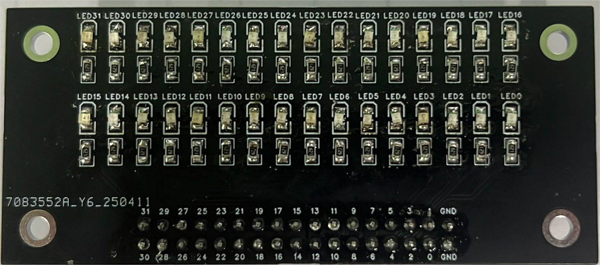
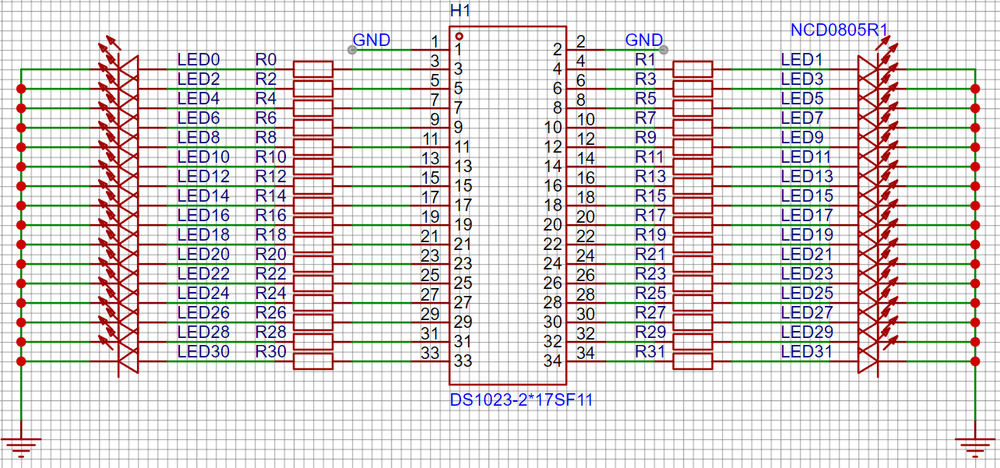
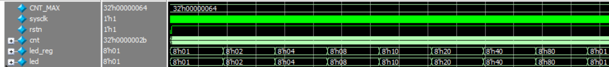
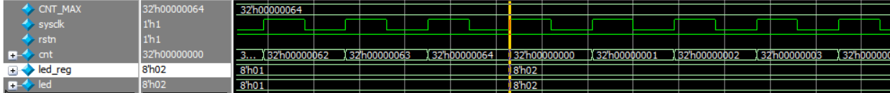

# 1.流水灯

## 1.1 章节导读

流水灯实验作为基础实验的第一个实验是非常合适的，本章我们利用试验箱中的LED进行点亮LED，并实现流水灯的功能。

## 1.2 理论学习

相信大家之前肯定接触过单片机等设备，而学习这些设备的第一个实验例程往往都是点亮一个LED。本次实验在点亮LED的基础上另LED灯依次闪亮，循环不止，实现“流水”的功能。其原理是依次控制连接到LED的IO口的电平高低，让LED的闪亮间隔为0.5s，以实现流水灯的效果。

## 1.3 实战演练

### 1.3.1实验目标

依次点亮实验板中的8个LED灯，两灯点亮间隔为0.5s，每次点亮持续0.5s，实现流水灯效果。

### 1.3.2硬件资源

实验板上有0~31共32个LED灯的资源，每4个LED灯为一组，分别是绿，红，蓝，黄四种颜色，本次实验使用8个LED进行验证。

<div>			<!--块级封装-->
    <center>	<!--将图片和文字居中-->
    
    <br>		<!--换行-->
    图1.LED扩展板	<!--标题-->
    </center>
</div>

通过原理图可以得知，本试验箱的LED灯为高电平时点亮。

<div>			<!--块级封装-->
    <center>	<!--将图片和文字居中-->
    
    <br>		<!--换行-->
    图2.LED扩展板原理图	<!--标题-->
    </center>
</div>

### 1.3.3程序设计

流水灯的设计与分频器，计数器的逻辑相似，只是多了LED灯的点亮部分。为了实现计数器肯定需要时钟信号sysclk，也需要一个复位信号rstn，同时为了驱动LED，需要8个IO口。所以模块的端口如下表所示：

| 端口名称 | 端口位宽               | 端口类型           |功能描述
|:----------:|:----:|:----:|:--------------------:|
| sysclk | 1Bit | Input | 输入时钟，频率27M |
| rstn | 1Bit | Input | 复位信号，低电平有效 |
| led | 8Bit | Output | LED控制信号 |


为了使灯点亮0.5s，我们应该设计一个计数器或者是分频器，先将板载27M高频时钟降速。在27M时钟下计数0.5s，需要计数器计数13_500_000个数，也就是计数器从0开始计数到13_499_999。所以我们定义一个寄存器cnt，每一次时钟上升沿cnt就加1，当计数到13_499_999时，led的状态改变，同时cnt归零重新开始计数。

为了实现8个led流水的效果，我们将0定义为led灭，1表示亮，初始状态led = 8’b0000_0001，当经过0.5s后，也就是cnt等于13_499_999的时候，第一个led灭，第二个led亮起，也就是led = 8‘b0000_0010。同理，再过0.5s，led = 8’b0000_0100，再过0.5s，led = 8‘b0000_1000以此类推。

根据上面的规律我们很容易发现，led的流水是靠1的移位来实现的，也就是最基本的左移(<<)和右移(>>)运算符去实现。在这里我们需要向左移位，并且每次只需要移动1位。模块的参考代码（waterled_top.v）如下所示：

```verilog
module waterled_top(
    input sysclk,    //27MHz system clock
    input rstn,      //active low reset
    output [7:0] led
   );
    parameter CNT_MAX = 32'd13_499_999;
    reg [7:0] led_reg;
    reg [31:0] cnt;
    //cnt 当cnt == CNT_MAX时变为0，计数0.5秒
    always @(posedge sysclk) begin
        if (!rstn)
            cnt <= 0;
        else if (cnt < CNT_MAX)
            cnt <= cnt + 1;
        else 
            cnt <= 0;
    end
    //led_reg 当cnt == CNT_MAX时，左移一位。
    always @(posedge sysclk) begin
        if (!rstn)
            led_reg <= 8'b0000_0001;
        else if (led_reg == 8'b1000_0000 && cnt == CNT_MAX)//led7亮0.5s后重回led0
            led_reg <= 8'b0000_0001; 
        else if (cnt == CNT_MAX) //0.5s后左移
            led_reg <= led_reg << 1;
        else
            led_reg <= led_reg;
    end
    //led
    assign led = led_reg;
endmodule
```

### 1.3.4仿真验证

为上述模块编写仿真模块，参考代码（waterled_top_tb.v）如下：

```verilog
`timescale 1ns/1ns
module waterled_top_tb;

    reg sysclk;
    reg rstn;
    wire [7:0] led;

    // 实例化待测试模块
    waterled_top #(
        .CNT_MAX(32'd100)//为了加快仿真速度，将模块内部CNT_MAX由13_499_999变为1000
    )uut (
        .sysclk(sysclk),
        .rstn(rstn),
        .led(led)
    );
    // 产生系统时钟：周期约为 27Mhz
    initial begin
        sysclk = 0;
        forever #(500/27) sysclk = ~sysclk;
    end
    // 初始化和复位过程
    initial begin
        // 初始化
        rstn = 0;
        #100;           // 保持复位100ns
        rstn = 1;       // 释放复位
    end
endmodule
```

为了加速仿真，我们在仿真文件中另CNT_MAX的值为100。同时为了便于仿真，可以直接点击sim文件夹下hebav文件夹中的do.bat文件即可利用ModuleSim对模块进行仿真，仿真波形如下：

<div>			<!--块级封装-->
    <center>	<!--将图片和文字居中-->
    
    <br>		<!--换行-->
    图3.流水灯仿真波形（一）	<!--标题-->
    </center>
</div>

<div>			<!--块级封装-->
    <center>	<!--将图片和文字居中-->
    
    <br>		<!--换行-->
    图4.流水灯仿真波形（二）	<!--标题-->
    </center>
</div>

从图3我们可以看到，端口信号led的值经过一定时间之后就进行了左移，并且在图4中我们也可以发现，当cnt的值等于CNT_MAX的时候led进行左移，与我们设计的目标相符合，可以进行下一步上板验证了。

### 1.3.5上板验证

仿真已经通过，可以进行上板验证，上板前要先进行管脚约束。端口与对应管脚如下表所示：
| 端口名称 |信号类型| 对应管脚|功能
|:----:|:----:|:----:|:----:|
| sysclk | Input |  | 时钟 |
| rstn | Input |  | 复位 |
| led[0] | Output |  | LED |
| led[1] | Output |  | LED |
| led[2] | Output |  | LED |
| led[3] | Output |  | LED |
| led[4] | Output |  | LED |
| led[5] | Output |  | LED |
| led[6] | Output |  | LED |
| led[7] | Output |  | LED |

管脚分配可以直接编写.fdc文件，也可以使用PDS内置的工具进行分配。

完成管脚分配之后就可以生成sbit文件，将文件提交到网站后点击烧录，即可将sbit下载到实验板中，在摄像头页面即可观察到流水灯的现象。

## 1.4 章末总结

本次实验主要学习使用左移(<<)和右移(>>)运算符实现移位，但实际应用中也可以使用位拼接（{}）进行更加复杂的移位操作，各位同学可以尝试学习。