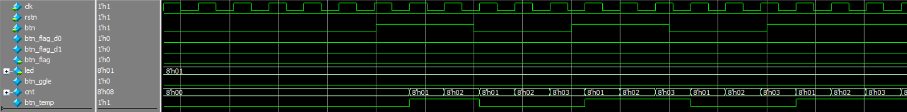

# 3. 按键检测与消抖

## 3.1 章节导读

在数字电路中，按键是最常用的人机交互输入方式。然而，机械式按键在按下或释放过程中会产生抖动信号，直接读取会引起误触发。本章我们将实现一个可靠的按键检测模块，完成信号的消抖和下降沿检测，以便为更复杂的模块如状态机切换、模式转换等提供稳定的触发信号。

## 3.2 理论学习

由于机械结构的限制，按键在触发的一瞬间，其接触点会发生数次抖动，导致输出信号在0和1之间反复跳变。这种现象称为“抖动”。为避免系统错误响应，需要对按键信号进行“消抖”处理。

常见的软件消抖方法包括定时器延时，而在软件中通常使用计数器。在本实验中，采用对输入信号进行采样判断，当其状态发生变化时开始计数，若持续稳定一定时长后，才认为按键真正改变。

在此基础上，若需检测按键的“按下事件”，则还需进一步提取其上升沿（或下降沿）作为一个单周期的“有效触发”信号。

## 3.3 实战演练

### 3.3.1 实验目标

实现一个具有消抖功能的按键检测模块，并进一步提取其下降沿触发信号，输出一个单时钟周期宽度的 `btn_flag` 信号，用于后级逻辑判断。同时为了使实验现象更加明显，设置8位的IO输出连接led，当检测到 `btn_flag` 信号后8位信号`led`会自加1。

### 3.3.2 硬件资源

本实验使用试验箱上普通按键输入资源，输入信号经过电平转换后进入 FPGA 芯片，输出信号可连接状态指示灯以观察效果。

根据原理图可知实验板的按键按下是低电平，不按为高电平。

<div>			<!--块级封装-->
    <center>	<!--将图片和文字居中-->
    
    <br>		<!--换行-->
    图1.实验板的按键资源	<!--标题-->
    </center>
</div>
<div>			<!--块级封装-->
    <center>	<!--将图片和文字居中-->
    
    <br>		<!--换行-->
    图2.实验板按键原理图	<!--标题-->
    </center>
</div>

<div>			<!--块级封装-->
    <center>	<!--将图片和文字居中-->
    
    <br>		<!--换行-->
    图3.远程实验界面按键	<!--标题-->
    </center>
</div>

### 3.3.3 程序设计

为了实现稳定的按键检测逻辑，设计流程如下：

1. 对输入 `btn` 进行采样，形成 `btn_temp`；
2. 若检测到 `btn_temp` 与当前 `btn` 状态不一致，则开始计数；
3. 若计数器 `cnt` 达到设定阈值（如255），则认为按键状态稳定，更新 `btn_ggle`；
4. 实验板的按键按下是低电平，不按为高电平。所以对 `btn_ggle` 打两拍形成 `btn_flag_d0` 和 `btn_flag_d1`，再判断其下降沿，输出一个时钟周期的`btn_flag`；
5. 检测到信号`btn_flag`后，信号`led <= led + 1`。

该模块的参考代码如下（`btn_ggle.v`）：

```verilog
module btn_ggle(
    input wire clk,
    input wire rstn,
    input wire btn,
    output wire btn_flag,
    output reg [7:0] led
);
reg btn_ggle;
reg btn_flag_d0,btn_flag_d1;
reg [7:0] cnt;
reg btn_temp;
//检测按键状态
always @(posedge clk) btn_temp <= btn;
//按键状态改变时开始计数
always @(posedge clk) begin
    if(~rstn) cnt <= 0;
    else if(btn_temp != btn) cnt <= 1;
    else if(cnt != 0) cnt <= cnt + 1;
    else cnt <= 0;
end
//计数到255时认为按键值稳定
always @(posedge clk) begin
    if(~rstn) btn_ggle <= btn;
    else if(cnt == 8'hFF) btn_ggle <= btn_temp;
    else btn_ggle <= btn_ggle;
end
//对btn_ggle信号延迟打拍
always @(posedge clk) begin
    if(~rstn) begin
        btn_flag_d0 <= 0;
        btn_flag_d1 <= 0;
    end
    else begin
        btn_flag_d0 <= btn_ggle;
        btn_flag_d1 <= btn_flag_d0;
    end
end
//btn_flag检测btn_ggle的下降沿
assign btn_flag = ~btn_flag_d0 && btn_flag_d1;
//检测到按键按下的标志位（btn_flag），led会加1
always @(posedge clk) begin
    if(~rstn) led <= 0;
    else if(btn_flag) led <= led + 1;
    else led <= led;
end
endmodule 
```

### 3.3.4 仿真验证

为验证功能的正确性，设计测试平台（`btn_ggle_tb.v`），代码如下：

```verilog
`timescale 1ns/1ns
module btn_ggle_tb;

reg clk;
reg rstn;
reg btn;
wire btn_flag;
wire [7:0] led;
btn_ggle btn_ggle_inst (
    .clk(clk),
    .rstn(rstn),
    .btn(btn),
    .btn_flag(btn_flag),
    .led(led)
);

// 27MHz 时钟周期约为 37.037ns，取37ns近似
always #(500/27) clk = ~clk; // 半周期18.5ns ≈ 27MHz

initial begin
    // 初始化
    clk = 0;
    rstn = 0;
    btn = 1;        // 按键默认未按下，高电平有效

    // 释放复位
    #200;
    rstn = 1;

    // 模拟带抖动的按下过程
    #1000  btn = 0;
    #100   btn = 1; // 抖动
    #100   btn = 0;
    #100   btn = 1;
    #100   btn = 0;
    // 稳定按下
    #100000 btn = 0;

    // 模拟抖动松开过程
    #300000 btn = 1;
    #100    btn = 0;
    #100    btn = 1;
    #100    btn = 0;
    #100    btn = 1;
    // 稳定松开
    #100000 btn = 1;

    // 第二次按下
    #300000 btn = 0;
    #100000 btn = 0;

    #300000 $finish;
end

endmodule
```

利用ModuleSim进行仿真，部分仿真波形如下图所示：

<div>			<!--块级封装-->
    <center>	<!--将图片和文字居中-->
    
    <br>		<!--换行-->
    图4.仿真波形（一）	<!--标题-->
    </center>
</div>

<div>			<!--块级封装-->
    <center>	<!--将图片和文字居中-->
    
    <br>		<!--换行-->
    图5.仿真波形（二）	<!--标题-->
    </center>
</div>
<div>			<!--块级封装-->
    <center>	<!--将图片和文字居中-->
    
    <br>		<!--换行-->
    图6.仿真波形（三）	<!--标题-->
    </center>
</div>

从仿真波形二和三中，我们可以看到，当我们模拟按键按下（1 ----> 0），当按键抖动（`btn`在0和1之间来回跳转）时，`cnt`的值会变回1重新开始计数，直到按键稳定按下（`btn`的值稳定不变，为0），`cnt`稳定增加，当`cnt`的值增加到`8‘hFF`时，认为按键按下，`btn_ggle`存储此时的按键状态，同时`btn_flag`检测到下降沿，拉高一个时钟周期。`led`信号也加一。


<div>			<!--块级封装-->
    <center>	<!--将图片和文字居中-->
    
    <br>		<!--换行-->
    图7.仿真波形（四）	<!--标题-->
    </center>
</div>
<div>			<!--块级封装-->
    <center>	<!--将图片和文字居中-->
    
    <br>		<!--换行-->
    图8.仿真波形（五）	<!--标题-->
    </center>
</div>


从波形三和四中，我们可以看到，当模拟按键抬起时（0 ----> 1），按键的抖动也会使`cnt`重新计数，直到稳定，`cnt`计数到`8’hFF`时，更新`btn_ggle`，由于按键是抬起，`btn_flag`不变，`led`不变。

### 3.3.5 上板验证

完成仿真后，可进行上板验证。端口连接如下表所示：

| 端口名称 | 类型    |  管脚 |说明       |
| -------- | ------ | ------ | ---------- |
| clk      | Input  |  | 27MHz 时钟 |
| rstn     | Input  |  | 低电平复位 |
| btn      | Input  |      | 外部按钮   |
| btn_flag | Output |      | 上升沿标志 |
| led[0] | Output |      | 驱动led |
| led[1] | Output |      | 驱动led |
| led[2] | Output |      | 驱动led    |
| led[3] | Output |      | 驱动led    |
| led[4] | Output |      | 驱动led    |
| led[5] | Output |      | 驱动led |
| led[6] | Output |      | 驱动led |
| led[7] | Output |      | 驱动led    |

将`.sbit`文件上传至平台，并下载到实验板，多次按下按键，观察led灯跳转，如果按下1次按键led只跳转一次，那么说明达成实验目标。

## 3.4 章末总结

本实验通过一个典型的按键检测例子，介绍了数字系统中常用的消抖和边沿检测方法，掌握了如何利用计数器和触发器组合进行抖动抑制与事件捕捉。在更复杂的设计中，这类基础模块可作为控制逻辑的可靠触发信号源，具有广泛应用价值。