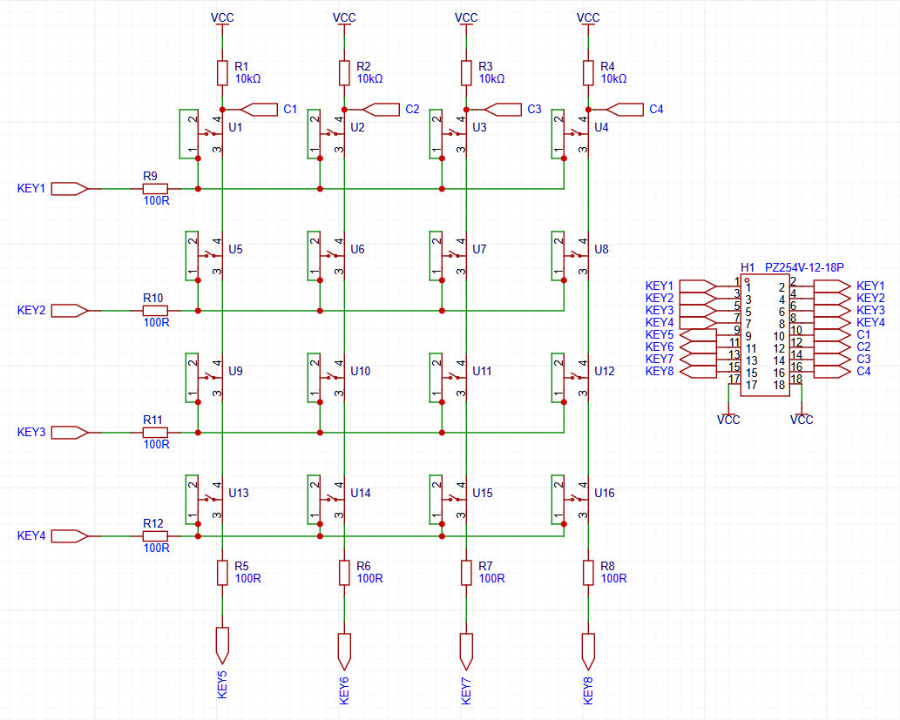

# 基础-4-矩阵键盘实验

## 4.1 章节导读
本章将介绍**矩阵键盘检测电路的设计与实现方法**，通过Verilog HDL语言完成4×4矩阵键盘的扫描识别模块，掌握**多键输入设备的行列扫描原理、消抖机制以及按键编码处理方式**。

矩阵键盘作为常见的人机交互接口之一，广泛应用于嵌入式系统、数字电路和微控制器项目中。与独立按键不同，矩阵键盘在节省IO资源的同时，对扫描逻辑和时序处理提出了更高的要求。实验中我们将采用**逐行扫描法**，结合状态机与延时消抖手段，确保按键信息的准确采集。


## 4.2 理论学习
### 4.2.1 矩阵键盘结构
<div>           <!--块级封装-->
    <center>    <!--将图片和文字居中-->
    
    <br>        <!--换行-->
    图1.矩阵键盘原理图 <!--标题-->
    </center>
</div>

实验板8个引脚分别连接矩阵键盘的KEY1~KEY8，该矩阵键盘的原理如下：将KEY1~KEY4脚设置为输出引脚，KEY5~KEY8设置为输入引脚。以KEY1和KEY5为例，当没有按键按下时，KEY1和VCC之间是断路，此时R1为上拉电阻，电路几乎没有电流流过，KEY5检测到的电压恰好是VCC，为1。**所以按键不按下，KEY5~KEY8检测到1。**

如果按键按下。此时KEY5~KEY8检测到的值与KEY1~KEY4的输出电压有关。以KEY1和KEY5为例，如果KEY1输出为0，按键1按下，VCC和KEY1之间形成通路，KEY5检测到0。但如果KEY1输出为1，此时即使按键按下，VCC和KEY1之间也几乎没有电流，此时KEY5检测到高阻态，也就是1。所以，**如果行输出电平为0，并且按键按下，KEY5~8会检测到0；如果行输出电平为1，按键按下，KEY5~8检测到1。**

现在我们看懂了原理图就可以开始设计verilog，根据原理图我们知道，只有行电平（KEY1~4的输出电平）为0时，按键按下，KEY5~8才会检测到0。那么我们可以用行扫描的逻辑设计：

1. FPGA按顺序将1到4行中的一行输出为低电平，其余3行为高电平（或高阻态）。
2. FPGA逐个读取每列引脚（KEY5~8）的电平，若某列为低电平，则说明该行和该列交汇处的按键被按下。
3. 可以在没有按键按下时，把所有行的输出电平都拉低，直到有按键按下时，重复1~2的步骤扫描。


## 4.2 实战演练
### 4.3.1 系统架构
``` verilog
系统框图：
[Top模块] = {矩阵键盘扫描模块 → 按键上升沿检测模块}
```

### 4.3.2 模块设计

根据上述原理，设计行扫描矩阵键盘检测模块如下：

#### matrix_key
```verilog
module matrix_key #(
    parameter ROW_NUM = 4,
    parameter COL_NUM = 4,
    parameter DEBOUNCE_TIME = 2000,
    parameter DELAY_TIME = 200
) (
    input  wire clk,
    input  wire rstn,
    output  reg [ROW_NUM-1:0] row,
    input  wire [COL_NUM-1:0] col,
    output  reg [ROW_NUM*COL_NUM-1:0] key_out
);

    localparam ROW_ACTIVE = 1'b0;   // 行有效电平
    localparam ROW_INACTIVE = 1'b1; // 行无效电平
    localparam COL_PRESSED = 1'b0;  // 列按下电平
    localparam COL_RELEASED = 1'b1; // 列释放电平
    
    reg [ROW_NUM-1:0][COL_NUM-1:0] key; // 按键状态寄存器

    reg [2:0] cu_st, nt_st;
    localparam [2:0] ST_IDLE = 3'b001;
    localparam [2:0] ST_SCAN = 3'b010;
    localparam [2:0] ST_DEBOUNCE = 3'b100;

    wire btn_pressed = ((|(~(col ^ {COL_NUM{COL_PRESSED}}))) && (cu_st == ST_IDLE)) || (key_out != 0); // 只要有一个按键按下，btn_pressed为1
    reg [31:0] delay_cnt; // 延时计数器
    reg [31:0] debounce_cnt; // 消抖计数器
    reg [ROW_NUM-1:0] row_cnt; // 行计数器

    always @(posedge clk or negedge rstn) begin
        if(!rstn) delay_cnt <= 0;
        else if(cu_st == ST_SCAN) begin
            if(delay_cnt == DELAY_TIME) delay_cnt <= 0;
            else delay_cnt <= delay_cnt + 1;
        end else delay_cnt <= 0;
    end

    always @(posedge clk or negedge rstn) begin
        if(!rstn) row_cnt <= 0;
        else if(cu_st == ST_SCAN) begin
            if(delay_cnt == DELAY_TIME) row_cnt <= row_cnt + 1;
            else row_cnt <= row_cnt;
        end else row_cnt <= 0;
    end

    always @(posedge clk or negedge rstn) begin
        if(!rstn) debounce_cnt <= 0;
        else if(cu_st == ST_DEBOUNCE) begin
            if(debounce_cnt == DEBOUNCE_TIME) debounce_cnt <= 0;
            else debounce_cnt <= debounce_cnt + 1;
        end else debounce_cnt <= 0;
    end

    /*
    处理逻辑
    ROW作为输出，COL作为输入
    1. ST_IDLE状态，所有ROW都拉至有效电平
    2. 若没有按键按下，所有COL都为释放电平
    3. 若有按键按下，按下的按键所在的COL会变为按下电平
    4. 进入ST_SCAN状态，启动扫描，ROW全部置为无效电平，并逐次改变为有效电平。（此时，COL会都变成列释放电平）
    5. 如果某一个ROW行有效电平时，COL变成了列按下电平，则说明该ROW和COL交点的按键被按下
    6. 每一行都扫描一遍。
    7. 进入ST_DEBOUNCE状态，所有ROW都拉至行有效电平，在此期间不进行扫描。
    8. DEBOUNCE时间到后，进入IDLE状态。
    */

    always @(posedge clk or negedge rstn) begin
        if(!rstn) cu_st <= ST_IDLE;
        else cu_st <= nt_st;
    end

    always @(*) begin
        if(!rstn) nt_st <= ST_IDLE;
        else case(cu_st)
            ST_IDLE: begin
                if(btn_pressed) nt_st <= ST_SCAN;
                else nt_st <= ST_IDLE;
            end
            ST_SCAN: begin
                if((delay_cnt == DELAY_TIME) && (row_cnt == ROW_NUM-1)) nt_st <= ST_DEBOUNCE;
                else nt_st <= ST_SCAN;
            end
            ST_DEBOUNCE: begin
                if(debounce_cnt == DEBOUNCE_TIME) nt_st <= ST_IDLE;
                else nt_st <= ST_DEBOUNCE;
            end
            default: nt_st <= ST_IDLE;
        endcase
    end

    integer i, j;
    always @(posedge clk or negedge rstn) begin
        if(!rstn) key <= 0;
        else for(i=0; i<ROW_NUM; i=i+1) 
                for(j=0; j<COL_NUM; j=j+1)
                    if((cu_st == ST_SCAN) && (delay_cnt == DELAY_TIME) && (row_cnt == i)) key[i][j] <= (col[j] == COL_PRESSED)?(1'b1):(1'b0);
                    else key[i][j] <= key[i][j]; // 其他情况不变
    end

    always @(*) begin
        for(i=0;i<ROW_NUM;i=i+1) begin
            for(j=0;j<COL_NUM;j=j+1) begin
                key_out[i*COL_NUM+j] <= key[i][j];
            end
        end
    end

    always @(posedge clk or negedge rstn) begin
        if(!rstn) row <= {ROW_NUM{ROW_ACTIVE}};
        else if(cu_st == ST_IDLE && nt_st == ST_SCAN) row <= {{(ROW_NUM-1){ROW_INACTIVE}}, ROW_ACTIVE};
        else if(cu_st == ST_SCAN) begin
            if(delay_cnt == DELAY_TIME) row <= {row[ROW_NUM-1:0],ROW_INACTIVE};
            else row <= row;
        end else row <= {ROW_NUM{ROW_ACTIVE}};
    end
endmodule //matrix_key
```

为了能够观察到现象，使用板载8个led和实验箱8个led进行显示，按下矩阵键盘的按键，对应led就会亮，顶层文件如下所示：

#### matrix_key_top

```verilog
module matrix_key_top(
//system io
input  wire       external_clk ,
input  wire       external_rstn,

input  wire [ 3:0] col,
output wire [ 3:0] row,
output wire [15:0] led
);

wire [15:0] key_out;

assign led = key_out;
matrix_key #(
	.ROW_NUM       	( 4     ),
	.COL_NUM       	( 4     ),
	.DEBOUNCE_TIME 	( 10000 ),
	.DELAY_TIME    	( 2000  ))
u_matrix_key(
	.clk     	( external_clk  ),
	.rstn    	( external_rstn ),
	.row     	( row           ),
	.col     	( col           ),
	.key_out 	( key_out       )
);
endmodule
```

### 4.3.3 上板验证步骤
1. 设置参数：CLK_CYCLE=5000（对应200Hz扫描频率）
2. 绑定管脚：连接led和矩阵键盘管脚

---

## 4.4 章末总结
**关键收获：**
1. 掌握矩阵键盘行扫描原理，能看懂原理图
3. 学习时序控制中计数器的重要作用

---

## 4.5 拓展训练

可以将数码管与矩阵键盘相结合