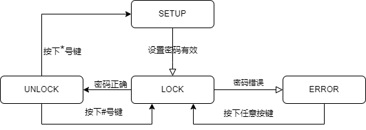

# 进阶-1-密码锁实验

## 1.1 章节导读
本章作为进阶的第一个实验，主要学习状态机的写法和使用，同时联系前面所学的数码管和矩阵键盘，完成一个密码锁的设计。


## 1.2 理论学习
### 1.2.1 FSM状态机

在数字逻辑设计中，**有限状态机（FSM, Finite State Machine）**是一种根据输入和当前状态决定下一个状态和输出的模型，广泛用于顺序逻辑电路的控制部分。

在本实验中，我们将使用 FSM 构建密码锁的控制逻辑，用于管理**按键输入过程、密码比对、开锁显示、错误处理等多个步骤**。

FSM 通常包含以下几个组成部分：

- **状态定义（State）**：用来描述系统当前所处的逻辑阶段。例如：待输入、输入中、校验中、成功、失败等。

- **状态转移条件（Transition）**：根据输入信号（如按键、定时器、复位）从一个状态跳转到另一个状态。

- **输出控制（Output）**：每个状态下系统应有的行为，比如更新数码管、检测密码、拉高开锁信号等。

常见的 FSM 类型包括：

- **Moore 状态机：**输出只与当前状态有关，结构更稳定；
- **Mealy 状态机：**输出与当前状态和输入有关，反应更灵敏。

在本例中我们要设计一个状态机去对密码锁进行控制。首先我们应该先给密码锁分一下他会处于什么状态，每个状态有什么输出（本例中将密码锁设计成下述4个状态）：

1. SETUP状态：该状态下可以设置4位密码，输入4位数字后按#键设置密码有效，*清空设置，数码管输出4位数字输入
2. LOCK状态：锁定状态，可以输入密码解锁，按#确定，*键清空输入，数码管输出4位数字输入
3. ERROR状态：如果输入密码错误，或者操作错误，进入此状态，数码管输出ERROR
4. UNLOCK状态：解锁状态，可以按*重设密码，也可以按#重新锁定，数码管输出UNLOCK

然后确定状态之间如何进行转移：

1. SETUP状态：输入4位数字后按#键设置密码有效，有效后进入LOCK状态
2. LOCK状态：输入密码，按#确定后如果密码正确进入UNLOCK状态，如果错误进入ERROR状态
3. ERROR状态：按下任意按键后进入LOCK状态
4. UNLOCK状态：按下#键进入LOCK状态，按*键进入SETUP状态重设密码

根据上述状态转移逻辑，我们可以画出状态转移图，状态转移图如下图所示：

<div>           <!--块级封装-->
    <center>    <!--将图片和文字居中-->
    
    <br>        <!--换行-->
    图1.状态转移图  <!--标题-->
    </center>
</div>

我们已经了解了本次实验所使用的状态机，那么如何使用verilog编写状态机呢？主要有三种方法，分别是：三段式状态机，二段式状态机，一段式状态机。

三段式状态机写法如下：

- 状态机第一段，时序逻辑，非阻塞赋值，传递寄存器的状态。
- 状态机第二段，组合逻辑，阻塞赋值，根据当前状态和当前输入，确定下一个状态机的状态。
- 状态机第三代，时序逻辑，非阻塞赋值，因为是 Mealy 型状态机，根据当前状态和当前输入，确定输出信号。

二段式状态机将三段式状态机二三段糅合在一起，一段式状态机则将三段式状态机三段融合。推荐使用三段式状态机，只有在状态转移逻辑非常简单，状态很少时会采用一段式状态机。

### 1.2.2 数码管

见基础实验3

### 1.2.3 矩阵键盘

见基础实验4

## 1.3 实战演练
### 1.3.1 系统架构
``` verilog
系统框图：
```

### 1.3.2 模块设计
首先是密码锁状态机逻辑，本例采用三段式状态机写法。代码如下：

#### password_lock

```verilog
module password_lock(
    input  wire clk,
    input  wire rstn,
    input  wire [15:0] key_trigger,
    output  reg [8*8-1:0] assic_seg,
    output wire [7:0] seg_point
);

/*
    K00   K01   K02   K03   |   1   2   3   A
                            |
    K04   K05   K06   K07   |   4   5   6   B   
                            |
    K08   K09   K10   K11   |   7   8   9   C
                            |
    K12   K13   K14   K15   |   *   0   #   D
*/

/*
密码锁状态机设定：
1. SETUP状态 ：设置密码，按*清空输入，按#确认输入进入LOCK状态，不足4位#键无效
2. LOCK状态  ：锁定状态，按*清空输入，按#确认输入，不足4位#键无效，密码正确解锁，错误则进入ERROR状态
3. ERROR状态 ：密码错误状态，按任意键返回LCOK状态
4. UNLOCK状态：解锁状态，按*重设密码，按#重新锁定，其余键无效

1-D键为输入
*为清空之前的输入
#为确认输入

*/

wire flag_setup_password;
wire flag_input_pass;
wire flag_input_confirm;
wire flag_error_return;
wire flag_relock;
wire flag_reset;

localparam [2:0] ST_SETUP  = 3'b001;
localparam [2:0] ST_LOCK   = 3'b010;
localparam [2:0] ST_ERROR  = 3'b100;
localparam [2:0] ST_UNLOCK = 3'b101;

reg [2:0] cu_st, nt_st;
reg [4*4-1:0] password, input_password;
reg [2:0] input_num;

assign flag_setup_password = (cu_st == ST_SETUP) && (key_trigger[14]) && (input_num == 3'b100);
assign flag_input_confirm  = (cu_st == ST_LOCK) && (key_trigger[14]) && (input_num == 3'b100);
assign flag_input_pass     = (cu_st == ST_LOCK) && (password == input_password) && (input_num == 3'b100);
assign flag_error_return   = (cu_st == ST_ERROR) && (|key_trigger);
assign flag_relock         = (cu_st == ST_UNLOCK) && (key_trigger[14]);
assign flag_reset          = (cu_st == ST_UNLOCK) && (key_trigger[12]);
//状态机第一段，传递寄存器状态
always @(posedge clk or negedge rstn) begin
    if(~rstn) cu_st <= ST_SETUP;
    else cu_st <= nt_st;
end
//状态机第二段，确定下一个状态机状态
always @(*) begin
    case(cu_st)
        ST_SETUP : nt_st <= (flag_setup_password)?(ST_LOCK):(ST_SETUP);
        ST_LOCK  : nt_st <= (flag_input_confirm)?((flag_input_pass)?(ST_UNLOCK):(ST_ERROR)):(ST_LOCK);
        ST_ERROR : nt_st <= (flag_error_return)?(ST_LOCK):(ST_ERROR);
        ST_UNLOCK: nt_st <= (flag_relock)?(ST_LOCK):((flag_reset)?(ST_SETUP):(ST_UNLOCK));
        default  : nt_st <= ST_SETUP;
    endcase
end
//状态机第三段，根据状态和输入确定输出，这里由于信号较多，分了多个always块，也可以用case语句写在同一个always块中
always @(posedge clk or negedge rstn) begin
    if(~rstn) password <= 0;
    else if((cu_st == ST_SETUP) && (input_num != 3'b100)) begin
             if(key_trigger[00]) password <= {password[0+:3*4], 4'h1};
        else if(key_trigger[01]) password <= {password[0+:3*4], 4'h2};
        else if(key_trigger[02]) password <= {password[0+:3*4], 4'h3};
        else if(key_trigger[03]) password <= {password[0+:3*4], 4'hA};
        else if(key_trigger[04]) password <= {password[0+:3*4], 4'h4};
        else if(key_trigger[05]) password <= {password[0+:3*4], 4'h5};
        else if(key_trigger[06]) password <= {password[0+:3*4], 4'h6};
        else if(key_trigger[07]) password <= {password[0+:3*4], 4'hB};
        else if(key_trigger[08]) password <= {password[0+:3*4], 4'h7};
        else if(key_trigger[09]) password <= {password[0+:3*4], 4'h8};
        else if(key_trigger[10]) password <= {password[0+:3*4], 4'h9};
        else if(key_trigger[11]) password <= {password[0+:3*4], 4'hC};
        else if(key_trigger[12]) password <= 0;
        else if(key_trigger[13]) password <= {password[0+:3*4], 4'h0};
        else if(key_trigger[14]) password <= password;
        else if(key_trigger[15]) password <= {password[0+:3*4], 4'hD};
        else password <= password;
    end else password <= password;
end

always @(posedge clk or negedge rstn) begin
    if(~rstn) input_password <= 0;
    else if(cu_st == ST_LOCK) begin
        if(input_num == 3'b100) input_password <= input_password;
        else if(key_trigger[00]) input_password <= {input_password[0+:3*4], 4'h1};
        else if(key_trigger[01]) input_password <= {input_password[0+:3*4], 4'h2};
        else if(key_trigger[02]) input_password <= {input_password[0+:3*4], 4'h3};
        else if(key_trigger[03]) input_password <= {input_password[0+:3*4], 4'hA};
        else if(key_trigger[04]) input_password <= {input_password[0+:3*4], 4'h4};
        else if(key_trigger[05]) input_password <= {input_password[0+:3*4], 4'h5};
        else if(key_trigger[06]) input_password <= {input_password[0+:3*4], 4'h6};
        else if(key_trigger[07]) input_password <= {input_password[0+:3*4], 4'hB};
        else if(key_trigger[08]) input_password <= {input_password[0+:3*4], 4'h7};
        else if(key_trigger[09]) input_password <= {input_password[0+:3*4], 4'h8};
        else if(key_trigger[10]) input_password <= {input_password[0+:3*4], 4'h9};
        else if(key_trigger[11]) input_password <= {input_password[0+:3*4], 4'hC};
        else if(key_trigger[12]) input_password <= 0;
        else if(key_trigger[13]) input_password <= {input_password[0+:3*4], 4'h0};
        else if(key_trigger[14]) input_password <= input_password;
        else if(key_trigger[15]) input_password <= {input_password[0+:3*4], 4'hD};
        else input_password <= input_password;
    end else input_password <= 0;
end

always @(posedge clk or negedge rstn) begin
    if(~rstn) input_num <= 0;
    else if(cu_st == ST_SETUP || cu_st == ST_LOCK) begin
        if(flag_setup_password || flag_input_confirm) input_num <= 0;
        else if(key_trigger[00] || key_trigger[01] || key_trigger[02] || key_trigger[03] ||
           key_trigger[04] || key_trigger[05] || key_trigger[06] || key_trigger[07] ||
           key_trigger[08] || key_trigger[09] || key_trigger[10] || key_trigger[11] ||
                              key_trigger[13]                    || key_trigger[15])
            input_num <= (input_num < 3'b100)?(input_num + 1):(input_num);
        else if(key_trigger[12]) input_num <= 0;
        else input_num <= input_num;
    end else input_num <= 0;
end

assign seg_point = 8'b0;
always @(posedge clk or negedge rstn) begin
    if(~rstn) assic_seg <= "12345678";
    else case(cu_st)
        ST_SETUP :begin
            assic_seg[0+:8] <= "-";
            assic_seg[8+:8] <= "-";
            assic_seg[16+:8] <= (input_num > 0)?(hex2assic(password[0+:4])):("_");
            assic_seg[24+:8] <= (input_num > 1)?(hex2assic(password[4+:4])):("_");
            assic_seg[32+:8] <= (input_num > 2)?(hex2assic(password[8+:4])):("_");
            assic_seg[40+:8] <= (input_num > 3)?(hex2assic(password[12+:4])):("_");
            assic_seg[48+:8] <= "-";
            assic_seg[56+:8] <= "-";
        end
        ST_LOCK  :begin
            assic_seg[0+:8] <= "=";
            assic_seg[8+:8] <= "=";
            assic_seg[16+:8] <= (input_num > 0)?(hex2assic(input_password[0+:4])):("-");
            assic_seg[24+:8] <= (input_num > 1)?(hex2assic(input_password[4+:4])):("-");
            assic_seg[32+:8] <= (input_num > 2)?(hex2assic(input_password[8+:4])):("-");
            assic_seg[40+:8] <= (input_num > 3)?(hex2assic(input_password[12+:4])):("-");
            assic_seg[48+:8] <= "=";
            assic_seg[56+:8] <= "=";
        end
        ST_ERROR : assic_seg <= "  ERROR ";
        ST_UNLOCK: assic_seg <= " unlock ";
        default  : assic_seg <= "12345678";
    endcase
end


function [7:0] hex2assic;
    input [3:0] hex;
    case(hex)
        4'h0: hex2assic = "0"; // 0
        4'h1: hex2assic = "1"; // 1
        4'h2: hex2assic = "2"; // 2
        4'h3: hex2assic = "3"; // 3
        4'h4: hex2assic = "4"; // 4
        4'h5: hex2assic = "5"; // 5
        4'h6: hex2assic = "6"; // 6
        4'h7: hex2assic = "7"; // 7
        4'h8: hex2assic = "8"; // 8
        4'h9: hex2assic = "9"; // 9
        4'hA: hex2assic = "A"; // A
        4'hB: hex2assic = "B"; // B
        4'hC: hex2assic = "C"; // C
        4'hD: hex2assic = "D"; // D
        4'hE: hex2assic = "E"; // E
        4'hF: hex2assic = "F"; // F
        default: hex2assic = " ";
    endcase
endfunction

endmodule //password_lock
```

矩阵键盘行扫描模块在前面基础实验已经介绍过，但这次实验还需要为矩阵键盘添加按键上升沿检测模块，代码如下：

#### matrix_key_trigger

```verilog
module matrix_key_trigger(
    input  wire clk,
    input  wire rstn,
    input  wire [15:0] key,
    output wire [15:0] key_trigger
);

// 按键上升沿捕获模块

reg [15:0] key_d; // 上一时钟周期的按键状态
reg [15:0] key_d2; // 上两时钟周期的按键状态

assign key_trigger = (key_d) & (~key_d2);

always @(posedge clk or negedge rstn) begin
    if (!rstn) begin
        key_d <= 0;
        key_d2 <= 0;
    end else begin
        key_d <= key;
        key_d2 <= key_d;
    end
end

endmodule //matrix_key_decode
```

至于数码管模块，为了方便，在led_display_driver模块添加了参数定义，并未进行其他修改。

最后将几个模块例化在顶层，将端口相连接，代码如下所示：

#### password_lock_top

```verilog

module password_lock_top #(
    parameter VALID_SIGNAL = 1'b0,
    parameter CLK_CYCLE = 5000
)(
//system io
input  wire       external_clk ,
input  wire       external_rstn,

output wire [7:0] led_display_seg,
output wire [7:0] led_display_sel,

input  wire [3:0] col,
output wire [3:0] row
);

wire [15:0] key_out;
wire [15:0] key_trigger;
wire [8*8-1:0] assic_seg;
wire [7:0] seg_point;

led_display_driver #(
    .VALID_SIGNAL (VALID_SIGNAL),
    .CLK_CYCLE (CLK_CYCLE)
)u_led_display_driver(
	.clk             	( external_clk    ),
	.rstn            	( external_rstn   ),
	.assic_seg       	( assic_seg       ),
	.seg_point       	( seg_point       ),
	.led_display_seg 	( led_display_seg ),
	.led_display_sel 	( led_display_sel )
);

matrix_key #(
	.ROW_NUM       	( 4     ),
	.COL_NUM       	( 4     ),
	.DEBOUNCE_TIME 	( 10000 ),
	.DELAY_TIME    	( 2000  ))
u_matrix_key(
	.clk     	( external_clk  ),
	.rstn    	( external_rstn ),
	.row     	( row           ),
	.col     	( col           ),
	.key_out 	( key_out       )
);

matrix_key_trigger u_matrix_key_trigger(
	.clk         	( external_clk ),
	.rstn        	( external_rstn),
	.key         	( key_out      ),
	.key_trigger 	( key_trigger  )
);

password_lock u_password_lock(
    .clk         	( external_clk ),
    .rstn        	( external_rstn),
    .key_trigger 	( key_trigger  ),
    .assic_seg   	( assic_seg    ),
	.seg_point   	( seg_point    )
);

endmodule //led_diaplay_top

```

### 1.3.3 上板验证步骤

---

可以直接将矩阵键盘，数码管的管脚约束文件中的约束复制到本次实验的管脚约束文件中。

将生成的sbit文件烧录好后，即可使用网页界面的虚拟按键进行使用。

## 1.4 章末总结

本章通过设计一个简易密码锁系统，综合运用了前面基础实验中学习的**矩阵键盘扫描**、**数码管显示**等知识，并引入了**有限状态机（FSM）**的设计方法，完成了一个具有较强工程实用性的综合实验。

通过本实验，你应该掌握了以下几点核心能力：

- 理解并运用 状态机进行系统流程控制；
- 将多个功能模块（键盘、数码管、比较器）整合为一个完整系统；
- 设计基于状态的控制逻辑，实现密码输入、校验、反馈显示等功能；
- 理解数字电路系统中控制与数据路径的分离思想。

密码锁系统虽然逻辑简单，但已经具备了完整嵌入式控制系统的基本结构，是后续更复杂项目设计的重要基础。

## 1.5 拓展训练

为了进一步加深对本实验内容的理解，并锻炼系统设计与工程实现能力，你可以尝试完成以下拓展任务：

1. **增加防爆破机制**：限定密码错误尝试次数，例如连续三次错误后锁定一段时间，并在数码管上提示“Err”。
2. **利用按键实现简易菜单系统**拓展状态机结构，允许通过矩阵键盘导航菜单，如“输入密码”、“查看状态”、“设置新密码”等。
