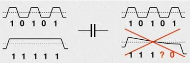
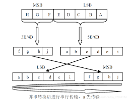
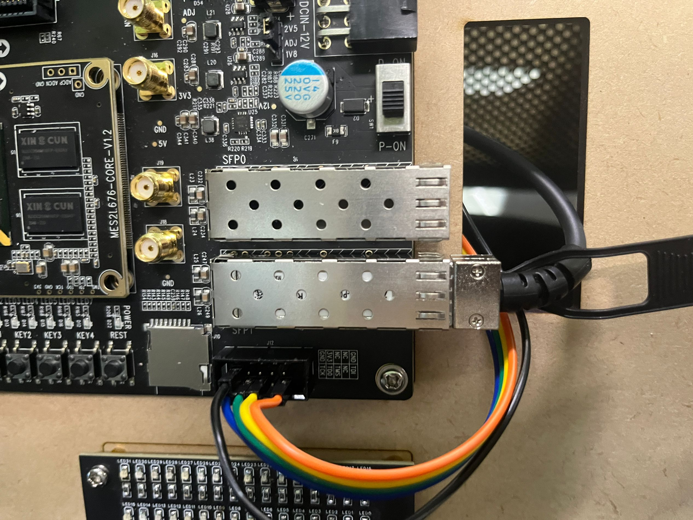
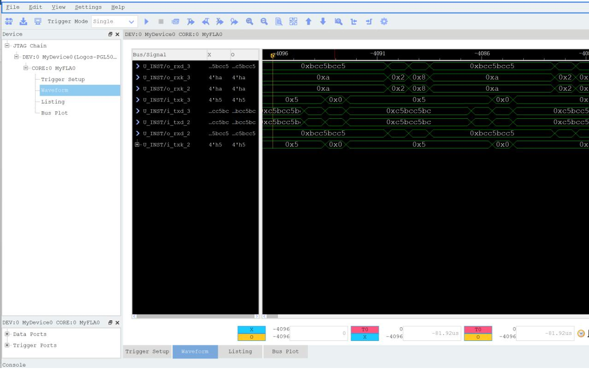

# 进阶-2-光纤通信

## 2.1 章节导读

在现代高速通信系统中，光纤通信作为一种重要的信息传输手段，广泛应用于数据中心、城域网、广域网以及各种嵌入式高速数据传输场景中。相比传统电缆传输，光纤具有带宽高、传输距离远、抗电磁干扰能力强、保密性好等显著优势，是实现高速、高可靠性通信的关键技术。

随着FPGA在通信领域的深入应用，基于FPGA的光纤通信系统设计成为一项非常实用的技能。在本实验中，我们将基于开发板配套的光纤接口模块，设计并实现一个基础的光纤通信收发系统。通过本实验，同学们将掌握光纤收发器（SFP模块）的基本使用方法，了解高速串行通信，8b10b编码等概念，并学会如何通过FPGA完成数据的高速发送与接收。

## 2.2 理论学习

### 2.2.1 8B10B编码

8b/10b 编码常用于光纤通信和 LVDS 信号中，其主要目的是解决信号传输过程中的直流不平衡问题。由于串行电路通常采用交流耦合的方式（串接电容）我们知道理想电容的[阻抗](https://so.csdn.net/so/search?q=阻抗&spm=1001.2101.3001.7020)公式 ，通过这个公式可以知道，频率f越高，阻抗越低，反之，频率越低，阻抗越高。

<div>			<!--块级封装-->
    <center>	<!--将图片和文字居中-->
    
    <br>		<!--换行-->
    图1.交流耦合	<!--标题-->
    </center>
</div>

如上图所示，当码型是高频的时候，基本可以不损耗的传输过去，但是当码型为连续的0或者1的时候，电容的损耗就很大，导致幅度不断降低，最严重的后果就是无法识别到底是0还是1，因此8b/10b编码就是为了尽量把低频的码型优化成较高频率的码型，从而降低阻抗带来的损耗。以光模块为例，它只能传输“亮”或“不亮”两种状态，即二进制的 1 和 0。当传输数据中出现长时间连续的 1 或 0（如 111111100000000)时，线路中电容的损耗就会很大，从而无法准确采样，进而造成误判。

同样，在 LVDS 高速传输中也存在类似问题。如果传输的 0 和 1 数量长期不均衡，线路上的基准电压会发生偏移，影响信号的正确识别。

因此，8b/10b 编码通过对每 8 位数据编码成 10 位信号，实现传输数据的直流平衡和足够的码流转换，也就是保证串行数据不会连续出现1和0，从而提升系统的可靠性和抗干扰能力。

那么8b10b编码是如何将8bit数据编码成10bit数据的呢？假设原始8位数据从高到低用HGFEDCBA表示，将8位数据分成高3位HGF和低5位EDCBA两个子组。经过5B/6B编码，将低5位EDCBA映射成abcdei；高3位经过3B/4B编码，映射成fghj，最后合成abcdeifghj发送。

<div>			<!--块级封装-->
    <center>	<!--将图片和文字居中-->
    
    <br>		<!--换行-->
    图2.8b10b编码原理
        <!--标题-->
    </center>
</div>

可见8b10b编码是基于5b/6b和3b/4b之上的。

<table class="ve-ce-branchNode ve-ce-tableNode ve-ce-mwTableNode wikitable jquery-tablesorter noime" style="text-align:center" id="mwOA" contenteditable="false"><caption id="mwOQ" class="ve-ce-branchNode ve-ce-activeNode ve-ce-tableCaptionNode noime ve-ce-activeNode-active" contenteditable="true" spellcheck="false"><p class="ve-ce-branchNode ve-ce-contentBranchNode ve-ce-paragraphNode ve-ce-generated-wrapper">5B/6B code</p></caption><tbody id="mwOg" class="ve-ce-branchNode"><tr id="mwOw" class="ve-ce-branchNode"><th colspan="2" id="mwPA" class="ve-ce-branchNode ve-ce-tableCellNode ve-ce-tableCellNode-header ve-ce-tableCellableNode" title="双击以编辑单元格" contenteditable="false" spellcheck="false"><p class="ve-ce-branchNode ve-ce-contentBranchNode ve-ce-paragraphNode ve-ce-generated-wrapper">input</p></th><th id="mwPQ" class="ve-ce-branchNode ve-ce-tableCellNode ve-ce-tableCellNode-header ve-ce-tableCellableNode" title="双击以编辑单元格" contenteditable="false" spellcheck="false"><p class="ve-ce-branchNode ve-ce-contentBranchNode ve-ce-paragraphNode ve-ce-generated-wrapper">RD = −1</p></th><th id="mwPg" class="ve-ce-branchNode ve-ce-tableCellNode ve-ce-tableCellNode-header ve-ce-tableCellableNode" title="双击以编辑单元格" contenteditable="false" spellcheck="false"><p class="ve-ce-branchNode ve-ce-contentBranchNode ve-ce-paragraphNode ve-ce-generated-wrapper">RD = +1</p></th><td rowspan="19" id="mwPw" class="ve-ce-branchNode ve-ce-tableCellNode ve-ce-tableCellNode-data ve-ce-tableCellableNode" title="双击以编辑单元格" contenteditable="false" spellcheck="false"><p class="ve-ce-branchNode ve-ce-contentBranchNode ve-ce-paragraphNode ve-ce-generated-wrapper"><span class="ve-ce-branchNode-slug ve-ce-branchNode-inlineSlug"></span></p></td><th colspan="2" id="mwQA" class="ve-ce-branchNode ve-ce-tableCellNode ve-ce-tableCellNode-header ve-ce-tableCellableNode" title="双击以编辑单元格" contenteditable="false" spellcheck="false"><p class="ve-ce-branchNode ve-ce-contentBranchNode ve-ce-paragraphNode ve-ce-generated-wrapper">input</p></th><th id="mwQQ" class="ve-ce-branchNode ve-ce-tableCellNode ve-ce-tableCellNode-header ve-ce-tableCellableNode" title="双击以编辑单元格" contenteditable="false" spellcheck="false"><p class="ve-ce-branchNode ve-ce-contentBranchNode ve-ce-paragraphNode ve-ce-generated-wrapper">RD = −1</p></th><th id="mwQg" class="ve-ce-branchNode ve-ce-tableCellNode ve-ce-tableCellNode-header ve-ce-tableCellableNode" title="双击以编辑单元格" contenteditable="false" spellcheck="false"><p class="ve-ce-branchNode ve-ce-contentBranchNode ve-ce-paragraphNode ve-ce-generated-wrapper">RD = +1</p></th></tr><tr id="mwQw" class="ve-ce-branchNode"><th id="mwRA" class="ve-ce-branchNode ve-ce-tableCellNode ve-ce-tableCellNode-header ve-ce-tableCellableNode" title="双击以编辑单元格" contenteditable="false" spellcheck="false"><p class="ve-ce-branchNode ve-ce-contentBranchNode ve-ce-paragraphNode ve-ce-generated-wrapper"><span class="ve-ce-branchNode-slug ve-ce-branchNode-inlineSlug"></span></p></th><th id="mwRQ" class="ve-ce-branchNode ve-ce-tableCellNode ve-ce-tableCellNode-header ve-ce-tableCellableNode" title="双击以编辑单元格" contenteditable="false" spellcheck="false"><p class="ve-ce-branchNode ve-ce-contentBranchNode ve-ce-paragraphNode ve-ce-generated-wrapper">EDCBA</p></th><th colspan="2" id="mwRg" class="ve-ce-branchNode ve-ce-tableCellNode ve-ce-tableCellNode-header ve-ce-tableCellableNode" title="双击以编辑单元格" contenteditable="false" spellcheck="false"><p class="ve-ce-branchNode ve-ce-contentBranchNode ve-ce-paragraphNode ve-ce-generated-wrapper">abcdei</p></th><th id="mwRw" class="ve-ce-branchNode ve-ce-tableCellNode ve-ce-tableCellNode-header ve-ce-tableCellableNode" title="双击以编辑单元格" contenteditable="false" spellcheck="false"><p class="ve-ce-branchNode ve-ce-contentBranchNode ve-ce-paragraphNode ve-ce-generated-wrapper"><span class="ve-ce-branchNode-slug ve-ce-branchNode-inlineSlug"></span></p></th><th id="mwSA" class="ve-ce-branchNode ve-ce-tableCellNode ve-ce-tableCellNode-header ve-ce-tableCellableNode" title="双击以编辑单元格" contenteditable="false" spellcheck="false"><p class="ve-ce-branchNode ve-ce-contentBranchNode ve-ce-paragraphNode ve-ce-generated-wrapper">EDCBA</p></th><th colspan="2" id="mwSQ" class="ve-ce-branchNode ve-ce-tableCellNode ve-ce-tableCellNode-header ve-ce-tableCellableNode" title="双击以编辑单元格" contenteditable="false" spellcheck="false"><p class="ve-ce-branchNode ve-ce-contentBranchNode ve-ce-paragraphNode ve-ce-generated-wrapper">abcdei</p></th></tr><tr id="mwSg" class="ve-ce-branchNode"><td id="mwSw" class="ve-ce-branchNode ve-ce-tableCellNode ve-ce-tableCellNode-data ve-ce-tableCellableNode" title="双击以编辑单元格" contenteditable="false" spellcheck="false"><p class="ve-ce-branchNode ve-ce-contentBranchNode ve-ce-paragraphNode ve-ce-generated-wrapper">D.00</p></td><td id="mwTA" class="ve-ce-branchNode ve-ce-tableCellNode ve-ce-tableCellNode-data ve-ce-tableCellableNode" title="双击以编辑单元格" contenteditable="false" spellcheck="false"><p class="ve-ce-branchNode ve-ce-contentBranchNode ve-ce-paragraphNode ve-ce-generated-wrapper">00000</p></td><td id="mwTQ" class="ve-ce-branchNode ve-ce-tableCellNode ve-ce-tableCellNode-data ve-ce-tableCellableNode" title="双击以编辑单元格" contenteditable="false" spellcheck="false"><p class="ve-ce-branchNode ve-ce-contentBranchNode ve-ce-paragraphNode ve-ce-generated-wrapper">100111</p></td><td id="mwTg" class="ve-ce-branchNode ve-ce-tableCellNode ve-ce-tableCellNode-data ve-ce-tableCellableNode" title="双击以编辑单元格" contenteditable="false" spellcheck="false"><p class="ve-ce-branchNode ve-ce-contentBranchNode ve-ce-paragraphNode ve-ce-generated-wrapper">011000</p></td><td id="mwTw" class="ve-ce-branchNode ve-ce-tableCellNode ve-ce-tableCellNode-data ve-ce-tableCellableNode" title="双击以编辑单元格" contenteditable="false" spellcheck="false"><p class="ve-ce-branchNode ve-ce-contentBranchNode ve-ce-paragraphNode ve-ce-generated-wrapper">D.16</p></td><td id="mwUA" class="ve-ce-branchNode ve-ce-tableCellNode ve-ce-tableCellNode-data ve-ce-tableCellableNode" title="双击以编辑单元格" contenteditable="false" spellcheck="false"><p class="ve-ce-branchNode ve-ce-contentBranchNode ve-ce-paragraphNode ve-ce-generated-wrapper">10000</p></td><td id="mwUQ" class="ve-ce-branchNode ve-ce-tableCellNode ve-ce-tableCellNode-data ve-ce-tableCellableNode" title="双击以编辑单元格" contenteditable="false" spellcheck="false"><p class="ve-ce-branchNode ve-ce-contentBranchNode ve-ce-paragraphNode ve-ce-generated-wrapper">011011</p></td><td id="mwUg" class="ve-ce-branchNode ve-ce-tableCellNode ve-ce-tableCellNode-data ve-ce-tableCellableNode" title="双击以编辑单元格" contenteditable="false" spellcheck="false"><p class="ve-ce-branchNode ve-ce-contentBranchNode ve-ce-paragraphNode ve-ce-generated-wrapper">100100</p></td></tr><tr id="mwUw" class="ve-ce-branchNode"><td id="mwVA" class="ve-ce-branchNode ve-ce-tableCellNode ve-ce-tableCellNode-data ve-ce-tableCellableNode" title="双击以编辑单元格" contenteditable="false" spellcheck="false"><p class="ve-ce-branchNode ve-ce-contentBranchNode ve-ce-paragraphNode ve-ce-generated-wrapper">D.01</p></td><td id="mwVQ" class="ve-ce-branchNode ve-ce-tableCellNode ve-ce-tableCellNode-data ve-ce-tableCellableNode" title="双击以编辑单元格" contenteditable="false" spellcheck="false"><p class="ve-ce-branchNode ve-ce-contentBranchNode ve-ce-paragraphNode ve-ce-generated-wrapper">00001</p></td><td id="mwVg" class="ve-ce-branchNode ve-ce-tableCellNode ve-ce-tableCellNode-data ve-ce-tableCellableNode" title="双击以编辑单元格" contenteditable="false" spellcheck="false"><p class="ve-ce-branchNode ve-ce-contentBranchNode ve-ce-paragraphNode ve-ce-generated-wrapper">011101</p></td><td id="mwVw" class="ve-ce-branchNode ve-ce-tableCellNode ve-ce-tableCellNode-data ve-ce-tableCellableNode" title="双击以编辑单元格" contenteditable="false" spellcheck="false"><p class="ve-ce-branchNode ve-ce-contentBranchNode ve-ce-paragraphNode ve-ce-generated-wrapper">100010</p></td><td id="mwWA" class="ve-ce-branchNode ve-ce-tableCellNode ve-ce-tableCellNode-data ve-ce-tableCellableNode" title="双击以编辑单元格" contenteditable="false" spellcheck="false"><p class="ve-ce-branchNode ve-ce-contentBranchNode ve-ce-paragraphNode ve-ce-generated-wrapper">D.17</p></td><td id="mwWQ" class="ve-ce-branchNode ve-ce-tableCellNode ve-ce-tableCellNode-data ve-ce-tableCellableNode" title="双击以编辑单元格" contenteditable="false" spellcheck="false"><p class="ve-ce-branchNode ve-ce-contentBranchNode ve-ce-paragraphNode ve-ce-generated-wrapper">10001</p></td><td colspan="2" id="mwWg" class="ve-ce-branchNode ve-ce-tableCellNode ve-ce-tableCellNode-data ve-ce-tableCellableNode" title="双击以编辑单元格" contenteditable="false" spellcheck="false"><p class="ve-ce-branchNode ve-ce-contentBranchNode ve-ce-paragraphNode ve-ce-generated-wrapper">100011</p></td></tr><tr id="mwWw" class="ve-ce-branchNode"><td id="mwXA" class="ve-ce-branchNode ve-ce-tableCellNode ve-ce-tableCellNode-data ve-ce-tableCellableNode" title="双击以编辑单元格" contenteditable="false" spellcheck="false"><p class="ve-ce-branchNode ve-ce-contentBranchNode ve-ce-paragraphNode ve-ce-generated-wrapper">D.02</p></td><td id="mwXQ" class="ve-ce-branchNode ve-ce-tableCellNode ve-ce-tableCellNode-data ve-ce-tableCellableNode" title="双击以编辑单元格" contenteditable="false" spellcheck="false"><p class="ve-ce-branchNode ve-ce-contentBranchNode ve-ce-paragraphNode ve-ce-generated-wrapper">00010</p></td><td id="mwXg" class="ve-ce-branchNode ve-ce-tableCellNode ve-ce-tableCellNode-data ve-ce-tableCellableNode" title="双击以编辑单元格" contenteditable="false" spellcheck="false"><p class="ve-ce-branchNode ve-ce-contentBranchNode ve-ce-paragraphNode ve-ce-generated-wrapper">101101</p></td><td id="mwXw" class="ve-ce-branchNode ve-ce-tableCellNode ve-ce-tableCellNode-data ve-ce-tableCellableNode" title="双击以编辑单元格" contenteditable="false" spellcheck="false"><p class="ve-ce-branchNode ve-ce-contentBranchNode ve-ce-paragraphNode ve-ce-generated-wrapper">010010</p></td><td id="mwYA" class="ve-ce-branchNode ve-ce-tableCellNode ve-ce-tableCellNode-data ve-ce-tableCellableNode" title="双击以编辑单元格" contenteditable="false" spellcheck="false"><p class="ve-ce-branchNode ve-ce-contentBranchNode ve-ce-paragraphNode ve-ce-generated-wrapper">D.18</p></td><td id="mwYQ" class="ve-ce-branchNode ve-ce-tableCellNode ve-ce-tableCellNode-data ve-ce-tableCellableNode" title="双击以编辑单元格" contenteditable="false" spellcheck="false"><p class="ve-ce-branchNode ve-ce-contentBranchNode ve-ce-paragraphNode ve-ce-generated-wrapper">10010</p></td><td colspan="2" id="mwYg" class="ve-ce-branchNode ve-ce-tableCellNode ve-ce-tableCellNode-data ve-ce-tableCellableNode" title="双击以编辑单元格" contenteditable="false" spellcheck="false"><p class="ve-ce-branchNode ve-ce-contentBranchNode ve-ce-paragraphNode ve-ce-generated-wrapper">010011</p></td></tr><tr id="mwYw" class="ve-ce-branchNode"><td id="mwZA" class="ve-ce-branchNode ve-ce-tableCellNode ve-ce-tableCellNode-data ve-ce-tableCellableNode" title="双击以编辑单元格" contenteditable="false" spellcheck="false"><p class="ve-ce-branchNode ve-ce-contentBranchNode ve-ce-paragraphNode ve-ce-generated-wrapper">D.03</p></td><td id="mwZQ" class="ve-ce-branchNode ve-ce-tableCellNode ve-ce-tableCellNode-data ve-ce-tableCellableNode" title="双击以编辑单元格" contenteditable="false" spellcheck="false"><p class="ve-ce-branchNode ve-ce-contentBranchNode ve-ce-paragraphNode ve-ce-generated-wrapper">00011</p></td><td colspan="2" id="mwZg" class="ve-ce-branchNode ve-ce-tableCellNode ve-ce-tableCellNode-data ve-ce-tableCellableNode" title="双击以编辑单元格" contenteditable="false" spellcheck="false"><p class="ve-ce-branchNode ve-ce-contentBranchNode ve-ce-paragraphNode ve-ce-generated-wrapper">110001</p></td><td id="mwZw" class="ve-ce-branchNode ve-ce-tableCellNode ve-ce-tableCellNode-data ve-ce-tableCellableNode" title="双击以编辑单元格" contenteditable="false" spellcheck="false"><p class="ve-ce-branchNode ve-ce-contentBranchNode ve-ce-paragraphNode ve-ce-generated-wrapper">D.19</p></td><td id="mwaA" class="ve-ce-branchNode ve-ce-tableCellNode ve-ce-tableCellNode-data ve-ce-tableCellableNode" title="双击以编辑单元格" contenteditable="false" spellcheck="false"><p class="ve-ce-branchNode ve-ce-contentBranchNode ve-ce-paragraphNode ve-ce-generated-wrapper">10011</p></td><td colspan="2" id="mwaQ" class="ve-ce-branchNode ve-ce-tableCellNode ve-ce-tableCellNode-data ve-ce-tableCellableNode" title="双击以编辑单元格" contenteditable="false" spellcheck="false"><p class="ve-ce-branchNode ve-ce-contentBranchNode ve-ce-paragraphNode ve-ce-generated-wrapper">110010</p></td></tr><tr id="mwag" class="ve-ce-branchNode"><td id="mwaw" class="ve-ce-branchNode ve-ce-tableCellNode ve-ce-tableCellNode-data ve-ce-tableCellableNode" title="双击以编辑单元格" contenteditable="false" spellcheck="false"><p class="ve-ce-branchNode ve-ce-contentBranchNode ve-ce-paragraphNode ve-ce-generated-wrapper">D.04</p></td><td id="mwbA" class="ve-ce-branchNode ve-ce-tableCellNode ve-ce-tableCellNode-data ve-ce-tableCellableNode" title="双击以编辑单元格" contenteditable="false" spellcheck="false"><p class="ve-ce-branchNode ve-ce-contentBranchNode ve-ce-paragraphNode ve-ce-generated-wrapper">00100</p></td><td id="mwbQ" class="ve-ce-branchNode ve-ce-tableCellNode ve-ce-tableCellNode-data ve-ce-tableCellableNode" title="双击以编辑单元格" contenteditable="false" spellcheck="false"><p class="ve-ce-branchNode ve-ce-contentBranchNode ve-ce-paragraphNode ve-ce-generated-wrapper">110101</p></td><td id="mwbg" class="ve-ce-branchNode ve-ce-tableCellNode ve-ce-tableCellNode-data ve-ce-tableCellableNode" title="双击以编辑单元格" contenteditable="false" spellcheck="false"><p class="ve-ce-branchNode ve-ce-contentBranchNode ve-ce-paragraphNode ve-ce-generated-wrapper">001010</p></td><td id="mwbw" class="ve-ce-branchNode ve-ce-tableCellNode ve-ce-tableCellNode-data ve-ce-tableCellableNode" title="双击以编辑单元格" contenteditable="false" spellcheck="false"><p class="ve-ce-branchNode ve-ce-contentBranchNode ve-ce-paragraphNode ve-ce-generated-wrapper">D.20</p></td><td id="mwcA" class="ve-ce-branchNode ve-ce-tableCellNode ve-ce-tableCellNode-data ve-ce-tableCellableNode" title="双击以编辑单元格" contenteditable="false" spellcheck="false"><p class="ve-ce-branchNode ve-ce-contentBranchNode ve-ce-paragraphNode ve-ce-generated-wrapper">10100</p></td><td colspan="2" id="mwcQ" class="ve-ce-branchNode ve-ce-tableCellNode ve-ce-tableCellNode-data ve-ce-tableCellableNode" title="双击以编辑单元格" contenteditable="false" spellcheck="false"><p class="ve-ce-branchNode ve-ce-contentBranchNode ve-ce-paragraphNode ve-ce-generated-wrapper">001011</p></td></tr><tr id="mwcg" class="ve-ce-branchNode"><td id="mwcw" class="ve-ce-branchNode ve-ce-tableCellNode ve-ce-tableCellNode-data ve-ce-tableCellableNode" title="双击以编辑单元格" contenteditable="false" spellcheck="false"><p class="ve-ce-branchNode ve-ce-contentBranchNode ve-ce-paragraphNode ve-ce-generated-wrapper">D.05</p></td><td id="mwdA" class="ve-ce-branchNode ve-ce-tableCellNode ve-ce-tableCellNode-data ve-ce-tableCellableNode" title="双击以编辑单元格" contenteditable="false" spellcheck="false"><p class="ve-ce-branchNode ve-ce-contentBranchNode ve-ce-paragraphNode ve-ce-generated-wrapper">00101</p></td><td colspan="2" id="mwdQ" class="ve-ce-branchNode ve-ce-tableCellNode ve-ce-tableCellNode-data ve-ce-tableCellableNode" title="双击以编辑单元格" contenteditable="false" spellcheck="false"><p class="ve-ce-branchNode ve-ce-contentBranchNode ve-ce-paragraphNode ve-ce-generated-wrapper">101001</p></td><td id="mwdg" class="ve-ce-branchNode ve-ce-tableCellNode ve-ce-tableCellNode-data ve-ce-tableCellableNode" title="双击以编辑单元格" contenteditable="false" spellcheck="false"><p class="ve-ce-branchNode ve-ce-contentBranchNode ve-ce-paragraphNode ve-ce-generated-wrapper">D.21</p></td><td id="mwdw" class="ve-ce-branchNode ve-ce-tableCellNode ve-ce-tableCellNode-data ve-ce-tableCellableNode" title="双击以编辑单元格" contenteditable="false" spellcheck="false"><p class="ve-ce-branchNode ve-ce-contentBranchNode ve-ce-paragraphNode ve-ce-generated-wrapper">10101</p></td><td colspan="2" id="mweA" class="ve-ce-branchNode ve-ce-tableCellNode ve-ce-tableCellNode-data ve-ce-tableCellableNode" title="双击以编辑单元格" contenteditable="false" spellcheck="false"><p class="ve-ce-branchNode ve-ce-contentBranchNode ve-ce-paragraphNode ve-ce-generated-wrapper">101010</p></td></tr><tr id="mweQ" class="ve-ce-branchNode"><td id="mweg" class="ve-ce-branchNode ve-ce-tableCellNode ve-ce-tableCellNode-data ve-ce-tableCellableNode" title="双击以编辑单元格" contenteditable="false" spellcheck="false"><p class="ve-ce-branchNode ve-ce-contentBranchNode ve-ce-paragraphNode ve-ce-generated-wrapper">D.06</p></td><td id="mwew" class="ve-ce-branchNode ve-ce-tableCellNode ve-ce-tableCellNode-data ve-ce-tableCellableNode" title="双击以编辑单元格" contenteditable="false" spellcheck="false"><p class="ve-ce-branchNode ve-ce-contentBranchNode ve-ce-paragraphNode ve-ce-generated-wrapper">00110</p></td><td colspan="2" id="mwfA" class="ve-ce-branchNode ve-ce-tableCellNode ve-ce-tableCellNode-data ve-ce-tableCellableNode" title="双击以编辑单元格" contenteditable="false" spellcheck="false"><p class="ve-ce-branchNode ve-ce-contentBranchNode ve-ce-paragraphNode ve-ce-generated-wrapper">011001</p></td><td id="mwfQ" class="ve-ce-branchNode ve-ce-tableCellNode ve-ce-tableCellNode-data ve-ce-tableCellableNode" title="双击以编辑单元格" contenteditable="false" spellcheck="false"><p class="ve-ce-branchNode ve-ce-contentBranchNode ve-ce-paragraphNode ve-ce-generated-wrapper">D.22</p></td><td id="mwfg" class="ve-ce-branchNode ve-ce-tableCellNode ve-ce-tableCellNode-data ve-ce-tableCellableNode" title="双击以编辑单元格" contenteditable="false" spellcheck="false"><p class="ve-ce-branchNode ve-ce-contentBranchNode ve-ce-paragraphNode ve-ce-generated-wrapper">10110</p></td><td colspan="2" id="mwfw" class="ve-ce-branchNode ve-ce-tableCellNode ve-ce-tableCellNode-data ve-ce-tableCellableNode" title="双击以编辑单元格" contenteditable="false" spellcheck="false"><p class="ve-ce-branchNode ve-ce-contentBranchNode ve-ce-paragraphNode ve-ce-generated-wrapper">011010</p></td></tr><tr id="mwgA" class="ve-ce-branchNode"><td id="mwgQ" class="ve-ce-branchNode ve-ce-tableCellNode ve-ce-tableCellNode-data ve-ce-tableCellableNode" title="双击以编辑单元格" contenteditable="false" spellcheck="false"><p class="ve-ce-branchNode ve-ce-contentBranchNode ve-ce-paragraphNode ve-ce-generated-wrapper">D.07</p></td><td id="mwgg" class="ve-ce-branchNode ve-ce-tableCellNode ve-ce-tableCellNode-data ve-ce-tableCellableNode" title="双击以编辑单元格" contenteditable="false" spellcheck="false"><p class="ve-ce-branchNode ve-ce-contentBranchNode ve-ce-paragraphNode ve-ce-generated-wrapper">00111</p></td><td id="mwgw" class="ve-ce-branchNode ve-ce-tableCellNode ve-ce-tableCellNode-data ve-ce-tableCellableNode" title="双击以编辑单元格" contenteditable="false" spellcheck="false"><p class="ve-ce-branchNode ve-ce-contentBranchNode ve-ce-paragraphNode ve-ce-generated-wrapper">111000</p></td><td id="mwhA" class="ve-ce-branchNode ve-ce-tableCellNode ve-ce-tableCellNode-data ve-ce-tableCellableNode" title="双击以编辑单元格" contenteditable="false" spellcheck="false"><p class="ve-ce-branchNode ve-ce-contentBranchNode ve-ce-paragraphNode ve-ce-generated-wrapper">000111</p></td><td id="mwhQ" class="ve-ce-branchNode ve-ce-tableCellNode ve-ce-tableCellNode-data ve-ce-tableCellableNode" title="双击以编辑单元格" contenteditable="false" spellcheck="false"><p class="ve-ce-branchNode ve-ce-contentBranchNode ve-ce-paragraphNode ve-ce-generated-wrapper">D.23 †</p></td><td id="mwhg" class="ve-ce-branchNode ve-ce-tableCellNode ve-ce-tableCellNode-data ve-ce-tableCellableNode" title="双击以编辑单元格" contenteditable="false" spellcheck="false"><p class="ve-ce-branchNode ve-ce-contentBranchNode ve-ce-paragraphNode ve-ce-generated-wrapper">10111</p></td><td id="mwhw" class="ve-ce-branchNode ve-ce-tableCellNode ve-ce-tableCellNode-data ve-ce-tableCellableNode" title="双击以编辑单元格" contenteditable="false" spellcheck="false"><p class="ve-ce-branchNode ve-ce-contentBranchNode ve-ce-paragraphNode ve-ce-generated-wrapper">111010</p></td><td id="mwiA" class="ve-ce-branchNode ve-ce-tableCellNode ve-ce-tableCellNode-data ve-ce-tableCellableNode" title="双击以编辑单元格" contenteditable="false" spellcheck="false"><p class="ve-ce-branchNode ve-ce-contentBranchNode ve-ce-paragraphNode ve-ce-generated-wrapper">000101</p></td></tr><tr id="mwiQ" class="ve-ce-branchNode"><td id="mwig" class="ve-ce-branchNode ve-ce-tableCellNode ve-ce-tableCellNode-data ve-ce-tableCellableNode" title="双击以编辑单元格" contenteditable="false" spellcheck="false"><p class="ve-ce-branchNode ve-ce-contentBranchNode ve-ce-paragraphNode ve-ce-generated-wrapper">D.08</p></td><td id="mwiw" class="ve-ce-branchNode ve-ce-tableCellNode ve-ce-tableCellNode-data ve-ce-tableCellableNode" title="双击以编辑单元格" contenteditable="false" spellcheck="false"><p class="ve-ce-branchNode ve-ce-contentBranchNode ve-ce-paragraphNode ve-ce-generated-wrapper">01000</p></td><td id="mwjA" class="ve-ce-branchNode ve-ce-tableCellNode ve-ce-tableCellNode-data ve-ce-tableCellableNode" title="双击以编辑单元格" contenteditable="false" spellcheck="false"><p class="ve-ce-branchNode ve-ce-contentBranchNode ve-ce-paragraphNode ve-ce-generated-wrapper">111001</p></td><td id="mwjQ" class="ve-ce-branchNode ve-ce-tableCellNode ve-ce-tableCellNode-data ve-ce-tableCellableNode" title="双击以编辑单元格" contenteditable="false" spellcheck="false"><p class="ve-ce-branchNode ve-ce-contentBranchNode ve-ce-paragraphNode ve-ce-generated-wrapper">000110</p></td><td id="mwjg" class="ve-ce-branchNode ve-ce-tableCellNode ve-ce-tableCellNode-data ve-ce-tableCellableNode" title="双击以编辑单元格" contenteditable="false" spellcheck="false"><p class="ve-ce-branchNode ve-ce-contentBranchNode ve-ce-paragraphNode ve-ce-generated-wrapper">D.24</p></td><td id="mwjw" class="ve-ce-branchNode ve-ce-tableCellNode ve-ce-tableCellNode-data ve-ce-tableCellableNode" title="双击以编辑单元格" contenteditable="false" spellcheck="false"><p class="ve-ce-branchNode ve-ce-contentBranchNode ve-ce-paragraphNode ve-ce-generated-wrapper">11000</p></td><td id="mwkA" class="ve-ce-branchNode ve-ce-tableCellNode ve-ce-tableCellNode-data ve-ce-tableCellableNode" title="双击以编辑单元格" contenteditable="false" spellcheck="false"><p class="ve-ce-branchNode ve-ce-contentBranchNode ve-ce-paragraphNode ve-ce-generated-wrapper">110011</p></td><td id="mwkQ" class="ve-ce-branchNode ve-ce-tableCellNode ve-ce-tableCellNode-data ve-ce-tableCellableNode" title="双击以编辑单元格" contenteditable="false" spellcheck="false"><p class="ve-ce-branchNode ve-ce-contentBranchNode ve-ce-paragraphNode ve-ce-generated-wrapper">001100</p></td></tr><tr id="mwkg" class="ve-ce-branchNode"><td id="mwkw" class="ve-ce-branchNode ve-ce-tableCellNode ve-ce-tableCellNode-data ve-ce-tableCellableNode" title="双击以编辑单元格" contenteditable="false" spellcheck="false"><p class="ve-ce-branchNode ve-ce-contentBranchNode ve-ce-paragraphNode ve-ce-generated-wrapper">D.09</p></td><td id="mwlA" class="ve-ce-branchNode ve-ce-tableCellNode ve-ce-tableCellNode-data ve-ce-tableCellableNode" title="双击以编辑单元格" contenteditable="false" spellcheck="false"><p class="ve-ce-branchNode ve-ce-contentBranchNode ve-ce-paragraphNode ve-ce-generated-wrapper">01001</p></td><td colspan="2" id="mwlQ" class="ve-ce-branchNode ve-ce-tableCellNode ve-ce-tableCellNode-data ve-ce-tableCellableNode" title="双击以编辑单元格" contenteditable="false" spellcheck="false"><p class="ve-ce-branchNode ve-ce-contentBranchNode ve-ce-paragraphNode ve-ce-generated-wrapper">100101</p></td><td id="mwlg" class="ve-ce-branchNode ve-ce-tableCellNode ve-ce-tableCellNode-data ve-ce-tableCellableNode" title="双击以编辑单元格" contenteditable="false" spellcheck="false"><p class="ve-ce-branchNode ve-ce-contentBranchNode ve-ce-paragraphNode ve-ce-generated-wrapper">D.25</p></td><td id="mwlw" class="ve-ce-branchNode ve-ce-tableCellNode ve-ce-tableCellNode-data ve-ce-tableCellableNode" title="双击以编辑单元格" contenteditable="false" spellcheck="false"><p class="ve-ce-branchNode ve-ce-contentBranchNode ve-ce-paragraphNode ve-ce-generated-wrapper">11001</p></td><td colspan="2" id="mwmA" class="ve-ce-branchNode ve-ce-tableCellNode ve-ce-tableCellNode-data ve-ce-tableCellableNode" title="双击以编辑单元格" contenteditable="false" spellcheck="false"><p class="ve-ce-branchNode ve-ce-contentBranchNode ve-ce-paragraphNode ve-ce-generated-wrapper">100110</p></td></tr><tr id="mwmQ" class="ve-ce-branchNode"><td id="mwmg" class="ve-ce-branchNode ve-ce-tableCellNode ve-ce-tableCellNode-data ve-ce-tableCellableNode" title="双击以编辑单元格" contenteditable="false" spellcheck="false"><p class="ve-ce-branchNode ve-ce-contentBranchNode ve-ce-paragraphNode ve-ce-generated-wrapper">D.10</p></td><td id="mwmw" class="ve-ce-branchNode ve-ce-tableCellNode ve-ce-tableCellNode-data ve-ce-tableCellableNode" title="双击以编辑单元格" contenteditable="false" spellcheck="false"><p class="ve-ce-branchNode ve-ce-contentBranchNode ve-ce-paragraphNode ve-ce-generated-wrapper">01010</p></td><td colspan="2" id="mwnA" class="ve-ce-branchNode ve-ce-tableCellNode ve-ce-tableCellNode-data ve-ce-tableCellableNode" title="双击以编辑单元格" contenteditable="false" spellcheck="false"><p class="ve-ce-branchNode ve-ce-contentBranchNode ve-ce-paragraphNode ve-ce-generated-wrapper">010101</p></td><td id="mwnQ" class="ve-ce-branchNode ve-ce-tableCellNode ve-ce-tableCellNode-data ve-ce-tableCellableNode" title="双击以编辑单元格" contenteditable="false" spellcheck="false"><p class="ve-ce-branchNode ve-ce-contentBranchNode ve-ce-paragraphNode ve-ce-generated-wrapper">D.26</p></td><td id="mwng" class="ve-ce-branchNode ve-ce-tableCellNode ve-ce-tableCellNode-data ve-ce-tableCellableNode" title="双击以编辑单元格" contenteditable="false" spellcheck="false"><p class="ve-ce-branchNode ve-ce-contentBranchNode ve-ce-paragraphNode ve-ce-generated-wrapper">11010</p></td><td colspan="2" id="mwnw" class="ve-ce-branchNode ve-ce-tableCellNode ve-ce-tableCellNode-data ve-ce-tableCellableNode" title="双击以编辑单元格" contenteditable="false" spellcheck="false"><p class="ve-ce-branchNode ve-ce-contentBranchNode ve-ce-paragraphNode ve-ce-generated-wrapper">010110</p></td></tr><tr id="mwoA" class="ve-ce-branchNode"><td id="mwoQ" class="ve-ce-branchNode ve-ce-tableCellNode ve-ce-tableCellNode-data ve-ce-tableCellableNode" title="双击以编辑单元格" contenteditable="false" spellcheck="false"><p class="ve-ce-branchNode ve-ce-contentBranchNode ve-ce-paragraphNode ve-ce-generated-wrapper">D.11</p></td><td id="mwog" class="ve-ce-branchNode ve-ce-tableCellNode ve-ce-tableCellNode-data ve-ce-tableCellableNode" title="双击以编辑单元格" contenteditable="false" spellcheck="false"><p class="ve-ce-branchNode ve-ce-contentBranchNode ve-ce-paragraphNode ve-ce-generated-wrapper">01011</p></td><td colspan="2" id="mwow" class="ve-ce-branchNode ve-ce-tableCellNode ve-ce-tableCellNode-data ve-ce-tableCellableNode" title="双击以编辑单元格" contenteditable="false" spellcheck="false"><p class="ve-ce-branchNode ve-ce-contentBranchNode ve-ce-paragraphNode ve-ce-generated-wrapper">110100</p></td><td id="mwpA" class="ve-ce-branchNode ve-ce-tableCellNode ve-ce-tableCellNode-data ve-ce-tableCellableNode" title="双击以编辑单元格" contenteditable="false" spellcheck="false"><p class="ve-ce-branchNode ve-ce-contentBranchNode ve-ce-paragraphNode ve-ce-generated-wrapper">D.27 †</p></td><td id="mwpQ" class="ve-ce-branchNode ve-ce-tableCellNode ve-ce-tableCellNode-data ve-ce-tableCellableNode" title="双击以编辑单元格" contenteditable="false" spellcheck="false"><p class="ve-ce-branchNode ve-ce-contentBranchNode ve-ce-paragraphNode ve-ce-generated-wrapper">11011</p></td><td id="mwpg" class="ve-ce-branchNode ve-ce-tableCellNode ve-ce-tableCellNode-data ve-ce-tableCellableNode" title="双击以编辑单元格" contenteditable="false" spellcheck="false"><p class="ve-ce-branchNode ve-ce-contentBranchNode ve-ce-paragraphNode ve-ce-generated-wrapper">110110</p></td><td id="mwpw" class="ve-ce-branchNode ve-ce-tableCellNode ve-ce-tableCellNode-data ve-ce-tableCellableNode" title="双击以编辑单元格" contenteditable="false" spellcheck="false"><p class="ve-ce-branchNode ve-ce-contentBranchNode ve-ce-paragraphNode ve-ce-generated-wrapper">001001</p></td></tr><tr id="mwqA" class="ve-ce-branchNode"><td id="mwqQ" class="ve-ce-branchNode ve-ce-tableCellNode ve-ce-tableCellNode-data ve-ce-tableCellableNode" title="双击以编辑单元格" contenteditable="false" spellcheck="false"><p class="ve-ce-branchNode ve-ce-contentBranchNode ve-ce-paragraphNode ve-ce-generated-wrapper">D.12</p></td><td id="mwqg" class="ve-ce-branchNode ve-ce-tableCellNode ve-ce-tableCellNode-data ve-ce-tableCellableNode" title="双击以编辑单元格" contenteditable="false" spellcheck="false"><p class="ve-ce-branchNode ve-ce-contentBranchNode ve-ce-paragraphNode ve-ce-generated-wrapper">01100</p></td><td colspan="2" id="mwqw" class="ve-ce-branchNode ve-ce-tableCellNode ve-ce-tableCellNode-data ve-ce-tableCellableNode" title="双击以编辑单元格" contenteditable="false" spellcheck="false"><p class="ve-ce-branchNode ve-ce-contentBranchNode ve-ce-paragraphNode ve-ce-generated-wrapper">001101</p></td><td id="mwrA" class="ve-ce-branchNode ve-ce-tableCellNode ve-ce-tableCellNode-data ve-ce-tableCellableNode" title="双击以编辑单元格" contenteditable="false" spellcheck="false"><p class="ve-ce-branchNode ve-ce-contentBranchNode ve-ce-paragraphNode ve-ce-generated-wrapper">D.28</p></td><td id="mwrQ" class="ve-ce-branchNode ve-ce-tableCellNode ve-ce-tableCellNode-data ve-ce-tableCellableNode" title="双击以编辑单元格" contenteditable="false" spellcheck="false"><p class="ve-ce-branchNode ve-ce-contentBranchNode ve-ce-paragraphNode ve-ce-generated-wrapper">11100</p></td><td colspan="2" id="mwrg" class="ve-ce-branchNode ve-ce-tableCellNode ve-ce-tableCellNode-data ve-ce-tableCellableNode" title="双击以编辑单元格" contenteditable="false" spellcheck="false"><p class="ve-ce-branchNode ve-ce-contentBranchNode ve-ce-paragraphNode ve-ce-generated-wrapper">001110</p></td></tr><tr id="mwrw" class="ve-ce-branchNode"><td id="mwsA" class="ve-ce-branchNode ve-ce-tableCellNode ve-ce-tableCellNode-data ve-ce-tableCellableNode" title="双击以编辑单元格" contenteditable="false" spellcheck="false"><p class="ve-ce-branchNode ve-ce-contentBranchNode ve-ce-paragraphNode ve-ce-generated-wrapper">D.13</p></td><td id="mwsQ" class="ve-ce-branchNode ve-ce-tableCellNode ve-ce-tableCellNode-data ve-ce-tableCellableNode" title="双击以编辑单元格" contenteditable="false" spellcheck="false"><p class="ve-ce-branchNode ve-ce-contentBranchNode ve-ce-paragraphNode ve-ce-generated-wrapper">01101</p></td><td colspan="2" id="mwsg" class="ve-ce-branchNode ve-ce-tableCellNode ve-ce-tableCellNode-data ve-ce-tableCellableNode" title="双击以编辑单元格" contenteditable="false" spellcheck="false"><p class="ve-ce-branchNode ve-ce-contentBranchNode ve-ce-paragraphNode ve-ce-generated-wrapper">101100</p></td><td id="mwsw" class="ve-ce-branchNode ve-ce-tableCellNode ve-ce-tableCellNode-data ve-ce-tableCellableNode" title="双击以编辑单元格" contenteditable="false" spellcheck="false"><p class="ve-ce-branchNode ve-ce-contentBranchNode ve-ce-paragraphNode ve-ce-generated-wrapper">D.29 †</p></td><td id="mwtA" class="ve-ce-branchNode ve-ce-tableCellNode ve-ce-tableCellNode-data ve-ce-tableCellableNode" title="双击以编辑单元格" contenteditable="false" spellcheck="false"><p class="ve-ce-branchNode ve-ce-contentBranchNode ve-ce-paragraphNode ve-ce-generated-wrapper">11101</p></td><td id="mwtQ" class="ve-ce-branchNode ve-ce-tableCellNode ve-ce-tableCellNode-data ve-ce-tableCellableNode" title="双击以编辑单元格" contenteditable="false" spellcheck="false"><p class="ve-ce-branchNode ve-ce-contentBranchNode ve-ce-paragraphNode ve-ce-generated-wrapper">101110</p></td><td id="mwtg" class="ve-ce-branchNode ve-ce-tableCellNode ve-ce-tableCellNode-data ve-ce-tableCellableNode" title="双击以编辑单元格" contenteditable="false" spellcheck="false"><p class="ve-ce-branchNode ve-ce-contentBranchNode ve-ce-paragraphNode ve-ce-generated-wrapper">010001</p></td></tr><tr id="mwtw" class="ve-ce-branchNode"><td id="mwuA" class="ve-ce-branchNode ve-ce-tableCellNode ve-ce-tableCellNode-data ve-ce-tableCellableNode" title="双击以编辑单元格" contenteditable="false" spellcheck="false"><p class="ve-ce-branchNode ve-ce-contentBranchNode ve-ce-paragraphNode ve-ce-generated-wrapper">D.14</p></td><td id="mwuQ" class="ve-ce-branchNode ve-ce-tableCellNode ve-ce-tableCellNode-data ve-ce-tableCellableNode" title="双击以编辑单元格" contenteditable="false" spellcheck="false"><p class="ve-ce-branchNode ve-ce-contentBranchNode ve-ce-paragraphNode ve-ce-generated-wrapper">01110</p></td><td colspan="2" id="mwug" class="ve-ce-branchNode ve-ce-tableCellNode ve-ce-tableCellNode-data ve-ce-tableCellableNode" title="双击以编辑单元格" contenteditable="false" spellcheck="false"><p class="ve-ce-branchNode ve-ce-contentBranchNode ve-ce-paragraphNode ve-ce-generated-wrapper">011100</p></td><td id="mwuw" class="ve-ce-branchNode ve-ce-tableCellNode ve-ce-tableCellNode-data ve-ce-tableCellableNode" title="双击以编辑单元格" contenteditable="false" spellcheck="false"><p class="ve-ce-branchNode ve-ce-contentBranchNode ve-ce-paragraphNode ve-ce-generated-wrapper">D.30 †</p></td><td id="mwvA" class="ve-ce-branchNode ve-ce-tableCellNode ve-ce-tableCellNode-data ve-ce-tableCellableNode" title="双击以编辑单元格" contenteditable="false" spellcheck="false"><p class="ve-ce-branchNode ve-ce-contentBranchNode ve-ce-paragraphNode ve-ce-generated-wrapper">11110</p></td><td id="mwvQ" class="ve-ce-branchNode ve-ce-tableCellNode ve-ce-tableCellNode-data ve-ce-tableCellableNode" title="双击以编辑单元格" contenteditable="false" spellcheck="false"><p class="ve-ce-branchNode ve-ce-contentBranchNode ve-ce-paragraphNode ve-ce-generated-wrapper">011110</p></td><td id="mwvg" class="ve-ce-branchNode ve-ce-tableCellNode ve-ce-tableCellNode-data ve-ce-tableCellableNode" title="双击以编辑单元格" contenteditable="false" spellcheck="false"><p class="ve-ce-branchNode ve-ce-contentBranchNode ve-ce-paragraphNode ve-ce-generated-wrapper">100001</p></td></tr><tr id="mwvw" class="ve-ce-branchNode"><td id="mwwA" class="ve-ce-branchNode ve-ce-tableCellNode ve-ce-tableCellNode-data ve-ce-tableCellableNode" title="双击以编辑单元格" contenteditable="false" spellcheck="false"><p class="ve-ce-branchNode ve-ce-contentBranchNode ve-ce-paragraphNode ve-ce-generated-wrapper">D.15</p></td><td id="mwwQ" class="ve-ce-branchNode ve-ce-tableCellNode ve-ce-tableCellNode-data ve-ce-tableCellableNode" title="双击以编辑单元格" contenteditable="false" spellcheck="false"><p class="ve-ce-branchNode ve-ce-contentBranchNode ve-ce-paragraphNode ve-ce-generated-wrapper">01111</p></td><td id="mwwg" class="ve-ce-branchNode ve-ce-tableCellNode ve-ce-tableCellNode-data ve-ce-tableCellableNode" title="双击以编辑单元格" contenteditable="false" spellcheck="false"><p class="ve-ce-branchNode ve-ce-contentBranchNode ve-ce-paragraphNode ve-ce-generated-wrapper">010111</p></td><td id="mwww" class="ve-ce-branchNode ve-ce-tableCellNode ve-ce-tableCellNode-data ve-ce-tableCellableNode" title="双击以编辑单元格" contenteditable="false" spellcheck="false"><p class="ve-ce-branchNode ve-ce-contentBranchNode ve-ce-paragraphNode ve-ce-generated-wrapper">101000</p></td><td id="mwxA" class="ve-ce-branchNode ve-ce-tableCellNode ve-ce-tableCellNode-data ve-ce-tableCellableNode" title="双击以编辑单元格" contenteditable="false" spellcheck="false"><p class="ve-ce-branchNode ve-ce-contentBranchNode ve-ce-paragraphNode ve-ce-generated-wrapper">D.31</p></td><td id="mwxQ" class="ve-ce-branchNode ve-ce-tableCellNode ve-ce-tableCellNode-data ve-ce-tableCellableNode" title="双击以编辑单元格" contenteditable="false" spellcheck="false"><p class="ve-ce-branchNode ve-ce-contentBranchNode ve-ce-paragraphNode ve-ce-generated-wrapper">11111</p></td><td id="mwxg" class="ve-ce-branchNode ve-ce-tableCellNode ve-ce-tableCellNode-data ve-ce-tableCellableNode" title="双击以编辑单元格" contenteditable="false" spellcheck="false"><p class="ve-ce-branchNode ve-ce-contentBranchNode ve-ce-paragraphNode ve-ce-generated-wrapper">101011</p></td><td id="mwxw" class="ve-ce-branchNode ve-ce-tableCellNode ve-ce-tableCellNode-data ve-ce-tableCellableNode" title="双击以编辑单元格" contenteditable="false" spellcheck="false"><p class="ve-ce-branchNode ve-ce-contentBranchNode ve-ce-paragraphNode ve-ce-generated-wrapper">010100</p></td></tr><tr id="mwyA" class="ve-ce-branchNode"><td colspan="4" id="mwyQ" class="ve-ce-branchNode ve-ce-tableCellNode ve-ce-tableCellNode-data ve-ce-tableCellableNode" title="双击以编辑单元格" contenteditable="false" spellcheck="false"><p class="ve-ce-branchNode ve-ce-contentBranchNode ve-ce-paragraphNode ve-ce-generated-wrapper"><span class="ve-ce-branchNode-slug ve-ce-branchNode-inlineSlug"></span></p></td><td id="mwyg" class="ve-ce-branchNode ve-ce-tableCellNode ve-ce-tableCellNode-data ve-ce-tableCellableNode" title="双击以编辑单元格" contenteditable="false" spellcheck="false"><p class="ve-ce-branchNode ve-ce-contentBranchNode ve-ce-paragraphNode ve-ce-generated-wrapper">K.28</p></td><td id="mwyw" class="ve-ce-branchNode ve-ce-tableCellNode ve-ce-tableCellNode-data ve-ce-tableCellableNode" title="双击以编辑单元格" contenteditable="false" spellcheck="false"><p class="ve-ce-branchNode ve-ce-contentBranchNode ve-ce-paragraphNode ve-ce-generated-wrapper">11100</p></td><td id="mwzA" class="ve-ce-branchNode ve-ce-tableCellNode ve-ce-tableCellNode-data ve-ce-tableCellableNode" title="双击以编辑单元格" contenteditable="false" spellcheck="false"><p class="ve-ce-branchNode ve-ce-contentBranchNode ve-ce-paragraphNode ve-ce-generated-wrapper">001111</p></td><td id="mwzQ" class="ve-ce-branchNode ve-ce-tableCellNode ve-ce-tableCellNode-data ve-ce-tableCellableNode" title="双击以编辑单元格" contenteditable="false" spellcheck="false"><p class="ve-ce-branchNode ve-ce-contentBranchNode ve-ce-paragraphNode ve-ce-generated-wrapper">110000</p></td></tr></tbody></table
    <div class="ve-ce-cursorHolder ve-ce-cursorHolder-after" contenteditable="true"></div>

<table class="ve-ce-branchNode ve-ce-tableNode ve-ce-mwTableNode wikitable jquery-tablesorter noime" style="text-align:center" id="mw0A" contenteditable="false"><caption id="mw0Q" class="ve-ce-branchNode ve-ce-activeNode ve-ce-tableCaptionNode noime ve-ce-activeNode-active" contenteditable="true" spellcheck="false"><p class="ve-ce-branchNode ve-ce-contentBranchNode ve-ce-paragraphNode ve-ce-generated-wrapper">3b/4b code</p></caption><tbody id="mw0g" class="ve-ce-branchNode"><tr id="mw0w" class="ve-ce-branchNode"><th colspan="2" id="mw1A" class="ve-ce-branchNode ve-ce-tableCellNode ve-ce-tableCellNode-header ve-ce-tableCellableNode" title="双击以编辑单元格" contenteditable="false" spellcheck="false"><p class="ve-ce-branchNode ve-ce-contentBranchNode ve-ce-paragraphNode ve-ce-generated-wrapper">input</p></th><th id="mw1Q" class="ve-ce-branchNode ve-ce-tableCellNode ve-ce-tableCellNode-header ve-ce-tableCellableNode" title="双击以编辑单元格" contenteditable="false" spellcheck="false"><p class="ve-ce-branchNode ve-ce-contentBranchNode ve-ce-paragraphNode ve-ce-generated-wrapper">RD = −1</p></th><th id="mw1g" class="ve-ce-branchNode ve-ce-tableCellNode ve-ce-tableCellNode-header ve-ce-tableCellableNode" title="双击以编辑单元格" contenteditable="false" spellcheck="false"><p class="ve-ce-branchNode ve-ce-contentBranchNode ve-ce-paragraphNode ve-ce-generated-wrapper">RD = +1</p></th><td rowspan="11" id="mw1w" class="ve-ce-branchNode ve-ce-tableCellNode ve-ce-tableCellNode-data ve-ce-tableCellableNode" title="双击以编辑单元格" contenteditable="false" spellcheck="false"><p class="ve-ce-branchNode ve-ce-contentBranchNode ve-ce-paragraphNode ve-ce-generated-wrapper"><span class="ve-ce-branchNode-slug ve-ce-branchNode-inlineSlug"></span></p></td><th colspan="2" id="mw2A" class="ve-ce-branchNode ve-ce-tableCellNode ve-ce-tableCellNode-header ve-ce-tableCellableNode" title="双击以编辑单元格" contenteditable="false" spellcheck="false"><p class="ve-ce-branchNode ve-ce-contentBranchNode ve-ce-paragraphNode ve-ce-generated-wrapper">input</p></th><th id="mw2Q" class="ve-ce-branchNode ve-ce-tableCellNode ve-ce-tableCellNode-header ve-ce-tableCellableNode" title="双击以编辑单元格" contenteditable="false" spellcheck="false"><p class="ve-ce-branchNode ve-ce-contentBranchNode ve-ce-paragraphNode ve-ce-generated-wrapper">RD = −1</p></th><th id="mw2g" class="ve-ce-branchNode ve-ce-tableCellNode ve-ce-tableCellNode-header ve-ce-tableCellableNode" title="双击以编辑单元格" contenteditable="false" spellcheck="false"><p class="ve-ce-branchNode ve-ce-contentBranchNode ve-ce-paragraphNode ve-ce-generated-wrapper">RD = +1</p></th></tr><tr id="mw2w" class="ve-ce-branchNode"><th id="mw3A" class="ve-ce-branchNode ve-ce-tableCellNode ve-ce-tableCellNode-header ve-ce-tableCellableNode" title="双击以编辑单元格" contenteditable="false" spellcheck="false"><p class="ve-ce-branchNode ve-ce-contentBranchNode ve-ce-paragraphNode ve-ce-generated-wrapper"><span class="ve-ce-branchNode-slug ve-ce-branchNode-inlineSlug"></span></p></th><th id="mw3Q" class="ve-ce-branchNode ve-ce-tableCellNode ve-ce-tableCellNode-header ve-ce-tableCellableNode" title="双击以编辑单元格" contenteditable="false" spellcheck="false"><p class="ve-ce-branchNode ve-ce-contentBranchNode ve-ce-paragraphNode ve-ce-generated-wrapper">HGF</p></th><th colspan="2" id="mw3g" class="ve-ce-branchNode ve-ce-tableCellNode ve-ce-tableCellNode-header ve-ce-tableCellableNode" title="双击以编辑单元格" contenteditable="false" spellcheck="false"><p class="ve-ce-branchNode ve-ce-contentBranchNode ve-ce-paragraphNode ve-ce-generated-wrapper">fghj</p></th><th id="mw3w" class="ve-ce-branchNode ve-ce-tableCellNode ve-ce-tableCellNode-header ve-ce-tableCellableNode" title="双击以编辑单元格" contenteditable="false" spellcheck="false"><p class="ve-ce-branchNode ve-ce-contentBranchNode ve-ce-paragraphNode ve-ce-generated-wrapper"><span class="ve-ce-branchNode-slug ve-ce-branchNode-inlineSlug"></span></p></th><th id="mw4A" class="ve-ce-branchNode ve-ce-tableCellNode ve-ce-tableCellNode-header ve-ce-tableCellableNode" title="双击以编辑单元格" contenteditable="false" spellcheck="false"><p class="ve-ce-branchNode ve-ce-contentBranchNode ve-ce-paragraphNode ve-ce-generated-wrapper">HGF</p></th><th colspan="2" id="mw4Q" class="ve-ce-branchNode ve-ce-tableCellNode ve-ce-tableCellNode-header ve-ce-tableCellableNode" title="双击以编辑单元格" contenteditable="false" spellcheck="false"><p class="ve-ce-branchNode ve-ce-contentBranchNode ve-ce-paragraphNode ve-ce-generated-wrapper">fghj</p></th></tr><tr id="mw4g" class="ve-ce-branchNode"><td id="mw4w" class="ve-ce-branchNode ve-ce-tableCellNode ve-ce-tableCellNode-data ve-ce-tableCellableNode" title="双击以编辑单元格" contenteditable="false" spellcheck="false"><p class="ve-ce-branchNode ve-ce-contentBranchNode ve-ce-paragraphNode ve-ce-generated-wrapper">D.x.0</p></td><td id="mw5A" class="ve-ce-branchNode ve-ce-tableCellNode ve-ce-tableCellNode-data ve-ce-tableCellableNode" title="双击以编辑单元格" contenteditable="false" spellcheck="false"><p class="ve-ce-branchNode ve-ce-contentBranchNode ve-ce-paragraphNode ve-ce-generated-wrapper">000</p></td><td id="mw5Q" class="ve-ce-branchNode ve-ce-tableCellNode ve-ce-tableCellNode-data ve-ce-tableCellableNode" title="双击以编辑单元格" contenteditable="false" spellcheck="false"><p class="ve-ce-branchNode ve-ce-contentBranchNode ve-ce-paragraphNode ve-ce-generated-wrapper">1011</p></td><td id="mw5g" class="ve-ce-branchNode ve-ce-tableCellNode ve-ce-tableCellNode-data ve-ce-tableCellableNode" title="双击以编辑单元格" contenteditable="false" spellcheck="false"><p class="ve-ce-branchNode ve-ce-contentBranchNode ve-ce-paragraphNode ve-ce-generated-wrapper">0100</p></td><td id="mw5w" class="ve-ce-branchNode ve-ce-tableCellNode ve-ce-tableCellNode-data ve-ce-tableCellableNode" title="双击以编辑单元格" contenteditable="false" spellcheck="false"><p class="ve-ce-branchNode ve-ce-contentBranchNode ve-ce-paragraphNode ve-ce-generated-wrapper">K.x.0</p></td><td id="mw6A" class="ve-ce-branchNode ve-ce-tableCellNode ve-ce-tableCellNode-data ve-ce-tableCellableNode" title="双击以编辑单元格" contenteditable="false" spellcheck="false"><p class="ve-ce-branchNode ve-ce-contentBranchNode ve-ce-paragraphNode ve-ce-generated-wrapper">000</p></td><td id="mw6Q" class="ve-ce-branchNode ve-ce-tableCellNode ve-ce-tableCellNode-data ve-ce-tableCellableNode" title="双击以编辑单元格" contenteditable="false" spellcheck="false"><p class="ve-ce-branchNode ve-ce-contentBranchNode ve-ce-paragraphNode ve-ce-generated-wrapper">1011</p></td><td id="mw6g" class="ve-ce-branchNode ve-ce-tableCellNode ve-ce-tableCellNode-data ve-ce-tableCellableNode" title="双击以编辑单元格" contenteditable="false" spellcheck="false"><p class="ve-ce-branchNode ve-ce-contentBranchNode ve-ce-paragraphNode ve-ce-generated-wrapper">0100</p></td></tr><tr id="mw6w" class="ve-ce-branchNode"><td id="mw7A" class="ve-ce-branchNode ve-ce-tableCellNode ve-ce-tableCellNode-data ve-ce-tableCellableNode" title="双击以编辑单元格" contenteditable="false" spellcheck="false"><p class="ve-ce-branchNode ve-ce-contentBranchNode ve-ce-paragraphNode ve-ce-generated-wrapper">D.x.1</p></td><td id="mw7Q" class="ve-ce-branchNode ve-ce-tableCellNode ve-ce-tableCellNode-data ve-ce-tableCellableNode" title="双击以编辑单元格" contenteditable="false" spellcheck="false"><p class="ve-ce-branchNode ve-ce-contentBranchNode ve-ce-paragraphNode ve-ce-generated-wrapper">001</p></td><td colspan="2" id="mw7g" class="ve-ce-branchNode ve-ce-tableCellNode ve-ce-tableCellNode-data ve-ce-tableCellableNode" title="双击以编辑单元格" contenteditable="false" spellcheck="false"><p class="ve-ce-branchNode ve-ce-contentBranchNode ve-ce-paragraphNode ve-ce-generated-wrapper">1001</p></td><td id="mw7w" class="ve-ce-branchNode ve-ce-tableCellNode ve-ce-tableCellNode-data ve-ce-tableCellableNode" title="双击以编辑单元格" contenteditable="false" spellcheck="false"><p class="ve-ce-branchNode ve-ce-contentBranchNode ve-ce-paragraphNode ve-ce-generated-wrapper">K.x.1 ‡</p></td><td id="mw8A" class="ve-ce-branchNode ve-ce-tableCellNode ve-ce-tableCellNode-data ve-ce-tableCellableNode" title="双击以编辑单元格" contenteditable="false" spellcheck="false"><p class="ve-ce-branchNode ve-ce-contentBranchNode ve-ce-paragraphNode ve-ce-generated-wrapper">001</p></td><td id="mw8Q" class="ve-ce-branchNode ve-ce-tableCellNode ve-ce-tableCellNode-data ve-ce-tableCellableNode" title="双击以编辑单元格" contenteditable="false" spellcheck="false"><p class="ve-ce-branchNode ve-ce-contentBranchNode ve-ce-paragraphNode ve-ce-generated-wrapper">0110</p></td><td id="mw8g" class="ve-ce-branchNode ve-ce-tableCellNode ve-ce-tableCellNode-data ve-ce-tableCellableNode" title="双击以编辑单元格" contenteditable="false" spellcheck="false"><p class="ve-ce-branchNode ve-ce-contentBranchNode ve-ce-paragraphNode ve-ce-generated-wrapper">1001</p></td></tr><tr id="mw8w" class="ve-ce-branchNode"><td id="mw9A" class="ve-ce-branchNode ve-ce-tableCellNode ve-ce-tableCellNode-data ve-ce-tableCellableNode" title="双击以编辑单元格" contenteditable="false" spellcheck="false"><p class="ve-ce-branchNode ve-ce-contentBranchNode ve-ce-paragraphNode ve-ce-generated-wrapper">D.x.2</p></td><td id="mw9Q" class="ve-ce-branchNode ve-ce-tableCellNode ve-ce-tableCellNode-data ve-ce-tableCellableNode" title="双击以编辑单元格" contenteditable="false" spellcheck="false"><p class="ve-ce-branchNode ve-ce-contentBranchNode ve-ce-paragraphNode ve-ce-generated-wrapper">010</p></td><td colspan="2" id="mw9g" class="ve-ce-branchNode ve-ce-tableCellNode ve-ce-tableCellNode-data ve-ce-tableCellableNode" title="双击以编辑单元格" contenteditable="false" spellcheck="false"><p class="ve-ce-branchNode ve-ce-contentBranchNode ve-ce-paragraphNode ve-ce-generated-wrapper">0101</p></td><td id="mw9w" class="ve-ce-branchNode ve-ce-tableCellNode ve-ce-tableCellNode-data ve-ce-tableCellableNode" title="双击以编辑单元格" contenteditable="false" spellcheck="false"><p class="ve-ce-branchNode ve-ce-contentBranchNode ve-ce-paragraphNode ve-ce-generated-wrapper">K.x.2 ‡</p></td><td id="mw-A" class="ve-ce-branchNode ve-ce-tableCellNode ve-ce-tableCellNode-data ve-ce-tableCellableNode" title="双击以编辑单元格" contenteditable="false" spellcheck="false"><p class="ve-ce-branchNode ve-ce-contentBranchNode ve-ce-paragraphNode ve-ce-generated-wrapper">010</p></td><td id="mw-Q" class="ve-ce-branchNode ve-ce-tableCellNode ve-ce-tableCellNode-data ve-ce-tableCellableNode" title="双击以编辑单元格" contenteditable="false" spellcheck="false"><p class="ve-ce-branchNode ve-ce-contentBranchNode ve-ce-paragraphNode ve-ce-generated-wrapper">1010</p></td><td id="mw-g" class="ve-ce-branchNode ve-ce-tableCellNode ve-ce-tableCellNode-data ve-ce-tableCellableNode" title="双击以编辑单元格" contenteditable="false" spellcheck="false"><p class="ve-ce-branchNode ve-ce-contentBranchNode ve-ce-paragraphNode ve-ce-generated-wrapper">0101</p></td></tr><tr id="mw-w" class="ve-ce-branchNode"><td id="mw_A" class="ve-ce-branchNode ve-ce-tableCellNode ve-ce-tableCellNode-data ve-ce-tableCellableNode" title="双击以编辑单元格" contenteditable="false" spellcheck="false"><p class="ve-ce-branchNode ve-ce-contentBranchNode ve-ce-paragraphNode ve-ce-generated-wrapper">D.x.3</p></td><td id="mw_Q" class="ve-ce-branchNode ve-ce-tableCellNode ve-ce-tableCellNode-data ve-ce-tableCellableNode" title="双击以编辑单元格" contenteditable="false" spellcheck="false"><p class="ve-ce-branchNode ve-ce-contentBranchNode ve-ce-paragraphNode ve-ce-generated-wrapper">011</p></td><td id="mw_g" class="ve-ce-branchNode ve-ce-tableCellNode ve-ce-tableCellNode-data ve-ce-tableCellableNode" title="双击以编辑单元格" contenteditable="false" spellcheck="false"><p class="ve-ce-branchNode ve-ce-contentBranchNode ve-ce-paragraphNode ve-ce-generated-wrapper">1100</p></td><td id="mw_w" class="ve-ce-branchNode ve-ce-tableCellNode ve-ce-tableCellNode-data ve-ce-tableCellableNode" title="双击以编辑单元格" contenteditable="false" spellcheck="false"><p class="ve-ce-branchNode ve-ce-contentBranchNode ve-ce-paragraphNode ve-ce-generated-wrapper">0011</p></td><td id="mwAQA" class="ve-ce-branchNode ve-ce-tableCellNode ve-ce-tableCellNode-data ve-ce-tableCellableNode" title="双击以编辑单元格" contenteditable="false" spellcheck="false"><p class="ve-ce-branchNode ve-ce-contentBranchNode ve-ce-paragraphNode ve-ce-generated-wrapper">K.x.3</p></td><td id="mwAQE" class="ve-ce-branchNode ve-ce-tableCellNode ve-ce-tableCellNode-data ve-ce-tableCellableNode" title="双击以编辑单元格" contenteditable="false" spellcheck="false"><p class="ve-ce-branchNode ve-ce-contentBranchNode ve-ce-paragraphNode ve-ce-generated-wrapper">011</p></td><td id="mwAQI" class="ve-ce-branchNode ve-ce-tableCellNode ve-ce-tableCellNode-data ve-ce-tableCellableNode" title="双击以编辑单元格" contenteditable="false" spellcheck="false"><p class="ve-ce-branchNode ve-ce-contentBranchNode ve-ce-paragraphNode ve-ce-generated-wrapper">1100</p></td><td id="mwAQM" class="ve-ce-branchNode ve-ce-tableCellNode ve-ce-tableCellNode-data ve-ce-tableCellableNode" title="双击以编辑单元格" contenteditable="false" spellcheck="false"><p class="ve-ce-branchNode ve-ce-contentBranchNode ve-ce-paragraphNode ve-ce-generated-wrapper">0011</p></td></tr><tr id="mwAQQ" class="ve-ce-branchNode"><td id="mwAQU" class="ve-ce-branchNode ve-ce-tableCellNode ve-ce-tableCellNode-data ve-ce-tableCellableNode" title="双击以编辑单元格" contenteditable="false" spellcheck="false"><p class="ve-ce-branchNode ve-ce-contentBranchNode ve-ce-paragraphNode ve-ce-generated-wrapper">D.x.4</p></td><td id="mwAQY" class="ve-ce-branchNode ve-ce-tableCellNode ve-ce-tableCellNode-data ve-ce-tableCellableNode" title="双击以编辑单元格" contenteditable="false" spellcheck="false"><p class="ve-ce-branchNode ve-ce-contentBranchNode ve-ce-paragraphNode ve-ce-generated-wrapper">100</p></td><td id="mwAQc" class="ve-ce-branchNode ve-ce-tableCellNode ve-ce-tableCellNode-data ve-ce-tableCellableNode" title="双击以编辑单元格" contenteditable="false" spellcheck="false"><p class="ve-ce-branchNode ve-ce-contentBranchNode ve-ce-paragraphNode ve-ce-generated-wrapper">1101</p></td><td id="mwAQg" class="ve-ce-branchNode ve-ce-tableCellNode ve-ce-tableCellNode-data ve-ce-tableCellableNode" title="双击以编辑单元格" contenteditable="false" spellcheck="false"><p class="ve-ce-branchNode ve-ce-contentBranchNode ve-ce-paragraphNode ve-ce-generated-wrapper">0010</p></td><td id="mwAQk" class="ve-ce-branchNode ve-ce-tableCellNode ve-ce-tableCellNode-data ve-ce-tableCellableNode" title="双击以编辑单元格" contenteditable="false" spellcheck="false"><p class="ve-ce-branchNode ve-ce-contentBranchNode ve-ce-paragraphNode ve-ce-generated-wrapper">K.x.4</p></td><td id="mwAQo" class="ve-ce-branchNode ve-ce-tableCellNode ve-ce-tableCellNode-data ve-ce-tableCellableNode" title="双击以编辑单元格" contenteditable="false" spellcheck="false"><p class="ve-ce-branchNode ve-ce-contentBranchNode ve-ce-paragraphNode ve-ce-generated-wrapper">100</p></td><td id="mwAQs" class="ve-ce-branchNode ve-ce-tableCellNode ve-ce-tableCellNode-data ve-ce-tableCellableNode" title="双击以编辑单元格" contenteditable="false" spellcheck="false"><p class="ve-ce-branchNode ve-ce-contentBranchNode ve-ce-paragraphNode ve-ce-generated-wrapper">1101</p></td><td id="mwAQw" class="ve-ce-branchNode ve-ce-tableCellNode ve-ce-tableCellNode-data ve-ce-tableCellableNode" title="双击以编辑单元格" contenteditable="false" spellcheck="false"><p class="ve-ce-branchNode ve-ce-contentBranchNode ve-ce-paragraphNode ve-ce-generated-wrapper">0010</p></td></tr><tr id="mwAQ0" class="ve-ce-branchNode"><td id="mwAQ4" class="ve-ce-branchNode ve-ce-tableCellNode ve-ce-tableCellNode-data ve-ce-tableCellableNode" title="双击以编辑单元格" contenteditable="false" spellcheck="false"><p class="ve-ce-branchNode ve-ce-contentBranchNode ve-ce-paragraphNode ve-ce-generated-wrapper">D.x.5</p></td><td id="mwAQ8" class="ve-ce-branchNode ve-ce-tableCellNode ve-ce-tableCellNode-data ve-ce-tableCellableNode" title="双击以编辑单元格" contenteditable="false" spellcheck="false"><p class="ve-ce-branchNode ve-ce-contentBranchNode ve-ce-paragraphNode ve-ce-generated-wrapper">101</p></td><td colspan="2" id="mwARA" class="ve-ce-branchNode ve-ce-tableCellNode ve-ce-tableCellNode-data ve-ce-tableCellableNode" title="双击以编辑单元格" contenteditable="false" spellcheck="false"><p class="ve-ce-branchNode ve-ce-contentBranchNode ve-ce-paragraphNode ve-ce-generated-wrapper">1010</p></td><td id="mwARE" class="ve-ce-branchNode ve-ce-tableCellNode ve-ce-tableCellNode-data ve-ce-tableCellableNode" title="双击以编辑单元格" contenteditable="false" spellcheck="false"><p class="ve-ce-branchNode ve-ce-contentBranchNode ve-ce-paragraphNode ve-ce-generated-wrapper">K.x.5 ‡</p></td><td id="mwARI" class="ve-ce-branchNode ve-ce-tableCellNode ve-ce-tableCellNode-data ve-ce-tableCellableNode" title="双击以编辑单元格" contenteditable="false" spellcheck="false"><p class="ve-ce-branchNode ve-ce-contentBranchNode ve-ce-paragraphNode ve-ce-generated-wrapper">101</p></td><td id="mwARM" class="ve-ce-branchNode ve-ce-tableCellNode ve-ce-tableCellNode-data ve-ce-tableCellableNode" title="双击以编辑单元格" contenteditable="false" spellcheck="false"><p class="ve-ce-branchNode ve-ce-contentBranchNode ve-ce-paragraphNode ve-ce-generated-wrapper">0101</p></td><td id="mwARQ" class="ve-ce-branchNode ve-ce-tableCellNode ve-ce-tableCellNode-data ve-ce-tableCellableNode" title="双击以编辑单元格" contenteditable="false" spellcheck="false"><p class="ve-ce-branchNode ve-ce-contentBranchNode ve-ce-paragraphNode ve-ce-generated-wrapper">1010</p></td></tr><tr id="mwARU" class="ve-ce-branchNode"><td id="mwARY" class="ve-ce-branchNode ve-ce-tableCellNode ve-ce-tableCellNode-data ve-ce-tableCellableNode" title="双击以编辑单元格" contenteditable="false" spellcheck="false"><p class="ve-ce-branchNode ve-ce-contentBranchNode ve-ce-paragraphNode ve-ce-generated-wrapper">D.x.6</p></td><td id="mwARc" class="ve-ce-branchNode ve-ce-tableCellNode ve-ce-tableCellNode-data ve-ce-tableCellableNode" title="双击以编辑单元格" contenteditable="false" spellcheck="false"><p class="ve-ce-branchNode ve-ce-contentBranchNode ve-ce-paragraphNode ve-ce-generated-wrapper">110</p></td><td colspan="2" id="mwARg" class="ve-ce-branchNode ve-ce-tableCellNode ve-ce-tableCellNode-data ve-ce-tableCellableNode" title="双击以编辑单元格" contenteditable="false" spellcheck="false"><p class="ve-ce-branchNode ve-ce-contentBranchNode ve-ce-paragraphNode ve-ce-generated-wrapper">0110</p></td><td id="mwARk" class="ve-ce-branchNode ve-ce-tableCellNode ve-ce-tableCellNode-data ve-ce-tableCellableNode" title="双击以编辑单元格" contenteditable="false" spellcheck="false"><p class="ve-ce-branchNode ve-ce-contentBranchNode ve-ce-paragraphNode ve-ce-generated-wrapper">K.x.6 ‡</p></td><td id="mwARo" class="ve-ce-branchNode ve-ce-tableCellNode ve-ce-tableCellNode-data ve-ce-tableCellableNode" title="双击以编辑单元格" contenteditable="false" spellcheck="false"><p class="ve-ce-branchNode ve-ce-contentBranchNode ve-ce-paragraphNode ve-ce-generated-wrapper">110</p></td><td id="mwARs" class="ve-ce-branchNode ve-ce-tableCellNode ve-ce-tableCellNode-data ve-ce-tableCellableNode" title="双击以编辑单元格" contenteditable="false" spellcheck="false"><p class="ve-ce-branchNode ve-ce-contentBranchNode ve-ce-paragraphNode ve-ce-generated-wrapper">1001</p></td><td id="mwARw" class="ve-ce-branchNode ve-ce-tableCellNode ve-ce-tableCellNode-data ve-ce-tableCellableNode" title="双击以编辑单元格" contenteditable="false" spellcheck="false"><p class="ve-ce-branchNode ve-ce-contentBranchNode ve-ce-paragraphNode ve-ce-generated-wrapper">0110</p></td></tr><tr id="mwAR0" class="ve-ce-branchNode"><td id="mwAR4" class="ve-ce-branchNode ve-ce-tableCellNode ve-ce-tableCellNode-data ve-ce-tableCellableNode" title="双击以编辑单元格" contenteditable="false" spellcheck="false"><p class="ve-ce-branchNode ve-ce-contentBranchNode ve-ce-paragraphNode ve-ce-generated-wrapper">D.x.P7 †</p></td><td id="mwAR8" class="ve-ce-branchNode ve-ce-tableCellNode ve-ce-tableCellNode-data ve-ce-tableCellableNode" title="双击以编辑单元格" contenteditable="false" spellcheck="false"><p class="ve-ce-branchNode ve-ce-contentBranchNode ve-ce-paragraphNode ve-ce-generated-wrapper">111</p></td><td id="mwASA" class="ve-ce-branchNode ve-ce-tableCellNode ve-ce-tableCellNode-data ve-ce-tableCellableNode" title="双击以编辑单元格" contenteditable="false" spellcheck="false"><p class="ve-ce-branchNode ve-ce-contentBranchNode ve-ce-paragraphNode ve-ce-generated-wrapper">1110</p></td><td id="mwASE" class="ve-ce-branchNode ve-ce-tableCellNode ve-ce-tableCellNode-data ve-ce-tableCellableNode" title="双击以编辑单元格" contenteditable="false" spellcheck="false"><p class="ve-ce-branchNode ve-ce-contentBranchNode ve-ce-paragraphNode ve-ce-generated-wrapper">0001</p></td><td id="mwASI" class="ve-ce-branchNode ve-ce-tableCellNode ve-ce-tableCellNode-data ve-ce-tableCellableNode" title="双击以编辑单元格" contenteditable="false" spellcheck="false"><p class="ve-ce-branchNode ve-ce-contentBranchNode ve-ce-paragraphNode ve-ce-generated-wrapper"><span class="ve-ce-branchNode-slug ve-ce-branchNode-inlineSlug"></span></p></td><td id="mwASM" class="ve-ce-branchNode ve-ce-tableCellNode ve-ce-tableCellNode-data ve-ce-tableCellableNode" title="双击以编辑单元格" contenteditable="false" spellcheck="false"><p class="ve-ce-branchNode ve-ce-contentBranchNode ve-ce-paragraphNode ve-ce-generated-wrapper"><span class="ve-ce-branchNode-slug ve-ce-branchNode-inlineSlug"></span></p></td><td id="mwASQ" class="ve-ce-branchNode ve-ce-tableCellNode ve-ce-tableCellNode-data ve-ce-tableCellableNode" title="双击以编辑单元格" contenteditable="false" spellcheck="false"><p class="ve-ce-branchNode ve-ce-contentBranchNode ve-ce-paragraphNode ve-ce-generated-wrapper"><span class="ve-ce-branchNode-slug ve-ce-branchNode-inlineSlug"></span></p></td><td contenteditable="false" class="ve-ce-branchNode-slug ve-ce-branchNode-blockSlug ve-ce-tableNode-missingCell"><span class="oo-ui-widget oo-ui-widget-enabled oo-ui-buttonElement oo-ui-buttonElement-frameless oo-ui-iconElement oo-ui-buttonWidget"><a class="oo-ui-buttonElement-button" role="button" tabindex="0" rel="nofollow"><span class="oo-ui-iconElement-icon oo-ui-icon-add"></span><span class="oo-ui-labelElement-label"></span><span class="oo-ui-indicatorElement-indicator oo-ui-indicatorElement-noIndicator"></span></a></span></td></tr><tr id="mwASU" class="ve-ce-branchNode"><td id="mwASY" class="ve-ce-branchNode ve-ce-tableCellNode ve-ce-tableCellNode-data ve-ce-tableCellableNode" title="双击以编辑单元格" contenteditable="false" spellcheck="false"><p class="ve-ce-branchNode ve-ce-contentBranchNode ve-ce-paragraphNode ve-ce-generated-wrapper">D.x.A7 †</p></td><td id="mwASc" class="ve-ce-branchNode ve-ce-tableCellNode ve-ce-tableCellNode-data ve-ce-tableCellableNode" title="双击以编辑单元格" contenteditable="false" spellcheck="false"><p class="ve-ce-branchNode ve-ce-contentBranchNode ve-ce-paragraphNode ve-ce-generated-wrapper">111</p></td><td id="mwASg" class="ve-ce-branchNode ve-ce-tableCellNode ve-ce-tableCellNode-data ve-ce-tableCellableNode" title="双击以编辑单元格" contenteditable="false" spellcheck="false"><p class="ve-ce-branchNode ve-ce-contentBranchNode ve-ce-paragraphNode ve-ce-generated-wrapper">0111</p></td><td id="mwASk" class="ve-ce-branchNode ve-ce-tableCellNode ve-ce-tableCellNode-data ve-ce-tableCellableNode" title="双击以编辑单元格" contenteditable="false" spellcheck="false"><p class="ve-ce-branchNode ve-ce-contentBranchNode ve-ce-paragraphNode ve-ce-generated-wrapper">1000</p></td><td id="mwASo" class="ve-ce-branchNode ve-ce-tableCellNode ve-ce-tableCellNode-data ve-ce-tableCellableNode" title="双击以编辑单元格" contenteditable="false" spellcheck="false"><p class="ve-ce-branchNode ve-ce-contentBranchNode ve-ce-paragraphNode ve-ce-generated-wrapper">K.x.7 † ‡</p></td><td id="mwASs" class="ve-ce-branchNode ve-ce-tableCellNode ve-ce-tableCellNode-data ve-ce-tableCellableNode" title="双击以编辑单元格" contenteditable="false" spellcheck="false"><p class="ve-ce-branchNode ve-ce-contentBranchNode ve-ce-paragraphNode ve-ce-generated-wrapper">111</p></td><td id="mwASw" class="ve-ce-branchNode ve-ce-tableCellNode ve-ce-tableCellNode-data ve-ce-tableCellableNode" title="双击以编辑单元格" contenteditable="false" spellcheck="false"><p class="ve-ce-branchNode ve-ce-contentBranchNode ve-ce-paragraphNode ve-ce-generated-wrapper">0111</p></td><td id="mwAS0" class="ve-ce-branchNode ve-ce-tableCellNode ve-ce-tableCellNode-data ve-ce-tableCellableNode" title="双击以编辑单元格" contenteditable="false" spellcheck="false"><p class="ve-ce-branchNode ve-ce-contentBranchNode ve-ce-paragraphNode ve-ce-generated-wrapper">1000</p></td></tr></tbody></table>

上述两张表格就是5b/6b和3b/4b编码表，那我们先来看懂这两张表格。

首先是D.x.y，将低5位EDCBA按其十进制数值记为x，将高3位按其十进制数值记为y，将原始8bit数据记为D.x.y。例如8bit数据最大为255，也就是111_11111，低五位是11111，也就是十进制31，高三位111，是十进制7，所对应的8b10b就是D.31.7。这也说明了上述5b/6b编码最大为D.31，3b/4b编码最大为D.x.7。

至于RD = - 1和RD = + 1。+ -分别表示0比1多，1比0多，多的个数是一样的，而且最多多两个。当0和1一样多时便没有+1-1之分。编码的初始化状态是-1。

对于D.x.7† ，当和5B/6B组合时D.x.P7和D.x.A7编码必须选择一个来避免连续的5个0或1。D.x.A7用在：x=17 x=18 x=20当RD=-1时； x=11 x=13 x=14 当RD=+1时。 其他情况下x.A7码不能被使用。

表里面D.23，D.27，D.29，D.30后面带 †，它有自己的特殊配对规则，当x=23 x=27 x=29 x=30时，3b/4b这边使用K.x.7进行编码。

 除了上面的一些编码，8b10b编码还规定了一些特殊的字符，也称为K码。K码表如下所示：

<table class="ve-ce-branchNode ve-ce-tableNode ve-ce-mwTableNode wikitable jquery-tablesorter" style="text-align:center" id="mwATA" contenteditable="false"><caption id="mwATE" class="ve-ce-branchNode ve-ce-activeNode ve-ce-tableCaptionNode" contenteditable="true" spellcheck="false"><p class="ve-ce-branchNode ve-ce-contentBranchNode ve-ce-paragraphNode ve-ce-generated-wrapper">控制符（Control symbols）</p></caption><tbody id="mwATI" class="ve-ce-branchNode"><tr id="mwATM" class="ve-ce-branchNode"><th colspan="2" id="mwATQ" class="ve-ce-branchNode ve-ce-tableCellNode ve-ce-tableCellNode-header ve-ce-tableCellableNode" title="双击以编辑单元格" contenteditable="false" spellcheck="false"><p class="ve-ce-branchNode ve-ce-contentBranchNode ve-ce-paragraphNode ve-ce-generated-wrapper">input</p></th><th id="mwATU" class="ve-ce-branchNode ve-ce-tableCellNode ve-ce-tableCellNode-header ve-ce-tableCellableNode" title="双击以编辑单元格" contenteditable="false" spellcheck="false"><p class="ve-ce-branchNode ve-ce-contentBranchNode ve-ce-paragraphNode ve-ce-generated-wrapper">RD = −1</p></th><th id="mwATY" class="ve-ce-branchNode ve-ce-tableCellNode ve-ce-tableCellNode-header ve-ce-tableCellableNode" title="双击以编辑单元格" contenteditable="false" spellcheck="false"><p class="ve-ce-branchNode ve-ce-contentBranchNode ve-ce-paragraphNode ve-ce-generated-wrapper">RD = +1</p></th></tr><tr id="mwATc" class="ve-ce-branchNode"><th id="mwATg" class="ve-ce-branchNode ve-ce-tableCellNode ve-ce-tableCellNode-header ve-ce-tableCellableNode" title="双击以编辑单元格" contenteditable="false" spellcheck="false"><p class="ve-ce-branchNode ve-ce-contentBranchNode ve-ce-paragraphNode ve-ce-generated-wrapper"><span class="ve-ce-branchNode-slug ve-ce-branchNode-inlineSlug"></span></p></th><th id="mwATk" class="ve-ce-branchNode ve-ce-tableCellNode ve-ce-tableCellNode-header ve-ce-tableCellableNode" title="双击以编辑单元格" contenteditable="false" spellcheck="false"><p class="ve-ce-branchNode ve-ce-contentBranchNode ve-ce-paragraphNode ve-ce-generated-wrapper">HGF EDCBA</p></th><th id="mwATo" class="ve-ce-branchNode ve-ce-tableCellNode ve-ce-tableCellNode-header ve-ce-tableCellableNode" title="双击以编辑单元格" contenteditable="false" spellcheck="false"><p class="ve-ce-branchNode ve-ce-contentBranchNode ve-ce-paragraphNode ve-ce-generated-wrapper">abcdei fghj</p></th><th id="mwATs" class="ve-ce-branchNode ve-ce-tableCellNode ve-ce-tableCellNode-header ve-ce-tableCellableNode" title="双击以编辑单元格" contenteditable="false" spellcheck="false"><p class="ve-ce-branchNode ve-ce-contentBranchNode ve-ce-paragraphNode ve-ce-generated-wrapper">abcdei fghj</p></th></tr><tr id="mwATw" class="ve-ce-branchNode"><td id="mwAT0" class="ve-ce-branchNode ve-ce-tableCellNode ve-ce-tableCellNode-data ve-ce-tableCellableNode" title="双击以编辑单元格" contenteditable="false" spellcheck="false"><p class="ve-ce-branchNode ve-ce-contentBranchNode ve-ce-paragraphNode ve-ce-generated-wrapper">K.28.0</p></td><td id="mwAT4" class="ve-ce-branchNode ve-ce-tableCellNode ve-ce-tableCellNode-data ve-ce-tableCellableNode" title="双击以编辑单元格" contenteditable="false" spellcheck="false"><p class="ve-ce-branchNode ve-ce-contentBranchNode ve-ce-paragraphNode ve-ce-generated-wrapper">000 11100</p></td><td id="mwAT8" class="ve-ce-branchNode ve-ce-tableCellNode ve-ce-tableCellNode-data ve-ce-tableCellableNode" title="双击以编辑单元格" contenteditable="false" spellcheck="false"><p class="ve-ce-branchNode ve-ce-contentBranchNode ve-ce-paragraphNode ve-ce-generated-wrapper">001111 0100</p></td><td id="mwAUA" class="ve-ce-branchNode ve-ce-tableCellNode ve-ce-tableCellNode-data ve-ce-tableCellableNode" title="双击以编辑单元格" contenteditable="false" spellcheck="false"><p class="ve-ce-branchNode ve-ce-contentBranchNode ve-ce-paragraphNode ve-ce-generated-wrapper">110000 1011</p></td></tr><tr id="mwAUE" class="ve-ce-branchNode"><td id="mwAUI" class="ve-ce-branchNode ve-ce-tableCellNode ve-ce-tableCellNode-data ve-ce-tableCellableNode" title="双击以编辑单元格" contenteditable="false" spellcheck="false"><p class="ve-ce-branchNode ve-ce-contentBranchNode ve-ce-paragraphNode ve-ce-generated-wrapper">K.28.1 †</p></td><td id="mwAUM" class="ve-ce-branchNode ve-ce-tableCellNode ve-ce-tableCellNode-data ve-ce-tableCellableNode" title="双击以编辑单元格" contenteditable="false" spellcheck="false"><p class="ve-ce-branchNode ve-ce-contentBranchNode ve-ce-paragraphNode ve-ce-generated-wrapper">001 11100</p></td><td id="mwAUQ" class="ve-ce-branchNode ve-ce-tableCellNode ve-ce-tableCellNode-data ve-ce-tableCellableNode" title="双击以编辑单元格" contenteditable="false" spellcheck="false"><p class="ve-ce-branchNode ve-ce-contentBranchNode ve-ce-paragraphNode ve-ce-generated-wrapper">001111 1001</p></td><td id="mwAUU" class="ve-ce-branchNode ve-ce-tableCellNode ve-ce-tableCellNode-data ve-ce-tableCellableNode" title="双击以编辑单元格" contenteditable="false" spellcheck="false"><p class="ve-ce-branchNode ve-ce-contentBranchNode ve-ce-paragraphNode ve-ce-generated-wrapper">110000 0110</p></td></tr><tr id="mwAUY" class="ve-ce-branchNode"><td id="mwAUc" class="ve-ce-branchNode ve-ce-tableCellNode ve-ce-tableCellNode-data ve-ce-tableCellableNode" title="双击以编辑单元格" contenteditable="false" spellcheck="false"><p class="ve-ce-branchNode ve-ce-contentBranchNode ve-ce-paragraphNode ve-ce-generated-wrapper">K.28.2<span typeof="mw:Entity" id="mwAUg" class="ve-ce-leafNode ve-ce-mwEntityNode ve-ce-mwEntityNode-nbsp" contenteditable="false" title="不换行空格">&nbsp;</span><span class="ve-ce-branchNode-slug ve-ce-branchNode-inlineSlug"></span></p></td><td id="mwAUk" class="ve-ce-branchNode ve-ce-tableCellNode ve-ce-tableCellNode-data ve-ce-tableCellableNode" title="双击以编辑单元格" contenteditable="false" spellcheck="false"><p class="ve-ce-branchNode ve-ce-contentBranchNode ve-ce-paragraphNode ve-ce-generated-wrapper">010 11100</p></td><td id="mwAUo" class="ve-ce-branchNode ve-ce-tableCellNode ve-ce-tableCellNode-data ve-ce-tableCellableNode" title="双击以编辑单元格" contenteditable="false" spellcheck="false"><p class="ve-ce-branchNode ve-ce-contentBranchNode ve-ce-paragraphNode ve-ce-generated-wrapper">001111 0101</p></td><td id="mwAUs" class="ve-ce-branchNode ve-ce-tableCellNode ve-ce-tableCellNode-data ve-ce-tableCellableNode" title="双击以编辑单元格" contenteditable="false" spellcheck="false"><p class="ve-ce-branchNode ve-ce-contentBranchNode ve-ce-paragraphNode ve-ce-generated-wrapper">110000 1010</p></td></tr><tr id="mwAUw" class="ve-ce-branchNode"><td id="mwAU0" class="ve-ce-branchNode ve-ce-tableCellNode ve-ce-tableCellNode-data ve-ce-tableCellableNode" title="双击以编辑单元格" contenteditable="false" spellcheck="false"><p class="ve-ce-branchNode ve-ce-contentBranchNode ve-ce-paragraphNode ve-ce-generated-wrapper">K.28.3<span typeof="mw:Entity" id="mwAU4" class="ve-ce-leafNode ve-ce-mwEntityNode ve-ce-mwEntityNode-nbsp" contenteditable="false" title="不换行空格">&nbsp;</span><span class="ve-ce-branchNode-slug ve-ce-branchNode-inlineSlug"></span></p></td><td id="mwAU8" class="ve-ce-branchNode ve-ce-tableCellNode ve-ce-tableCellNode-data ve-ce-tableCellableNode" title="双击以编辑单元格" contenteditable="false" spellcheck="false"><p class="ve-ce-branchNode ve-ce-contentBranchNode ve-ce-paragraphNode ve-ce-generated-wrapper">011 11100</p></td><td id="mwAVA" class="ve-ce-branchNode ve-ce-tableCellNode ve-ce-tableCellNode-data ve-ce-tableCellableNode" title="双击以编辑单元格" contenteditable="false" spellcheck="false"><p class="ve-ce-branchNode ve-ce-contentBranchNode ve-ce-paragraphNode ve-ce-generated-wrapper">001111 0011</p></td><td id="mwAVE" class="ve-ce-branchNode ve-ce-tableCellNode ve-ce-tableCellNode-data ve-ce-tableCellableNode" title="双击以编辑单元格" contenteditable="false" spellcheck="false"><p class="ve-ce-branchNode ve-ce-contentBranchNode ve-ce-paragraphNode ve-ce-generated-wrapper">110000 1100</p></td></tr><tr id="mwAVI" class="ve-ce-branchNode"><td id="mwAVM" class="ve-ce-branchNode ve-ce-tableCellNode ve-ce-tableCellNode-data ve-ce-tableCellableNode" title="双击以编辑单元格" contenteditable="false" spellcheck="false"><p class="ve-ce-branchNode ve-ce-contentBranchNode ve-ce-paragraphNode ve-ce-generated-wrapper">K.28.4<span typeof="mw:Entity" id="mwAVQ" class="ve-ce-leafNode ve-ce-mwEntityNode ve-ce-mwEntityNode-nbsp" contenteditable="false" title="不换行空格">&nbsp;</span><span class="ve-ce-branchNode-slug ve-ce-branchNode-inlineSlug"></span></p></td><td id="mwAVU" class="ve-ce-branchNode ve-ce-tableCellNode ve-ce-tableCellNode-data ve-ce-tableCellableNode" title="双击以编辑单元格" contenteditable="false" spellcheck="false"><p class="ve-ce-branchNode ve-ce-contentBranchNode ve-ce-paragraphNode ve-ce-generated-wrapper">100 11100</p></td><td id="mwAVY" class="ve-ce-branchNode ve-ce-tableCellNode ve-ce-tableCellNode-data ve-ce-tableCellableNode" title="双击以编辑单元格" contenteditable="false" spellcheck="false"><p class="ve-ce-branchNode ve-ce-contentBranchNode ve-ce-paragraphNode ve-ce-generated-wrapper">001111 0010</p></td><td id="mwAVc" class="ve-ce-branchNode ve-ce-tableCellNode ve-ce-tableCellNode-data ve-ce-tableCellableNode" title="双击以编辑单元格" contenteditable="false" spellcheck="false"><p class="ve-ce-branchNode ve-ce-contentBranchNode ve-ce-paragraphNode ve-ce-generated-wrapper">110000 1101</p></td></tr><tr id="mwAVg" class="ve-ce-branchNode"><td id="mwAVk" class="ve-ce-branchNode ve-ce-tableCellNode ve-ce-tableCellNode-data ve-ce-tableCellableNode" title="双击以编辑单元格" contenteditable="false" spellcheck="false"><p class="ve-ce-branchNode ve-ce-contentBranchNode ve-ce-paragraphNode ve-ce-generated-wrapper">K.28.5 †</p></td><td id="mwAVo" class="ve-ce-branchNode ve-ce-tableCellNode ve-ce-tableCellNode-data ve-ce-tableCellableNode" title="双击以编辑单元格" contenteditable="false" spellcheck="false"><p class="ve-ce-branchNode ve-ce-contentBranchNode ve-ce-paragraphNode ve-ce-generated-wrapper">101 11100</p></td><td id="mwAVs" class="ve-ce-branchNode ve-ce-tableCellNode ve-ce-tableCellNode-data ve-ce-tableCellableNode" title="双击以编辑单元格" contenteditable="false" spellcheck="false"><p class="ve-ce-branchNode ve-ce-contentBranchNode ve-ce-paragraphNode ve-ce-generated-wrapper">001111 1010</p></td><td id="mwAVw" class="ve-ce-branchNode ve-ce-tableCellNode ve-ce-tableCellNode-data ve-ce-tableCellableNode" title="双击以编辑单元格" contenteditable="false" spellcheck="false"><p class="ve-ce-branchNode ve-ce-contentBranchNode ve-ce-paragraphNode ve-ce-generated-wrapper">110000 0101</p></td></tr><tr id="mwAV0" class="ve-ce-branchNode"><td id="mwAV4" class="ve-ce-branchNode ve-ce-tableCellNode ve-ce-tableCellNode-data ve-ce-tableCellableNode" title="双击以编辑单元格" contenteditable="false" spellcheck="false"><p class="ve-ce-branchNode ve-ce-contentBranchNode ve-ce-paragraphNode ve-ce-generated-wrapper">K.28.6<span typeof="mw:Entity" id="mwAV8" class="ve-ce-leafNode ve-ce-mwEntityNode ve-ce-mwEntityNode-nbsp" contenteditable="false" title="不换行空格">&nbsp;</span><span class="ve-ce-branchNode-slug ve-ce-branchNode-inlineSlug"></span></p></td><td id="mwAWA" class="ve-ce-branchNode ve-ce-tableCellNode ve-ce-tableCellNode-data ve-ce-tableCellableNode" title="双击以编辑单元格" contenteditable="false" spellcheck="false"><p class="ve-ce-branchNode ve-ce-contentBranchNode ve-ce-paragraphNode ve-ce-generated-wrapper">110 11100</p></td><td id="mwAWE" class="ve-ce-branchNode ve-ce-tableCellNode ve-ce-tableCellNode-data ve-ce-tableCellableNode" title="双击以编辑单元格" contenteditable="false" spellcheck="false"><p class="ve-ce-branchNode ve-ce-contentBranchNode ve-ce-paragraphNode ve-ce-generated-wrapper">001111 0110</p></td><td id="mwAWI" class="ve-ce-branchNode ve-ce-tableCellNode ve-ce-tableCellNode-data ve-ce-tableCellableNode" title="双击以编辑单元格" contenteditable="false" spellcheck="false"><p class="ve-ce-branchNode ve-ce-contentBranchNode ve-ce-paragraphNode ve-ce-generated-wrapper">110000 1001</p></td></tr><tr id="mwAWM" class="ve-ce-branchNode"><td id="mwAWQ" class="ve-ce-branchNode ve-ce-tableCellNode ve-ce-tableCellNode-data ve-ce-tableCellableNode" title="双击以编辑单元格" contenteditable="false" spellcheck="false"><p class="ve-ce-branchNode ve-ce-contentBranchNode ve-ce-paragraphNode ve-ce-generated-wrapper">K.28.7 ‡</p></td><td id="mwAWU" class="ve-ce-branchNode ve-ce-tableCellNode ve-ce-tableCellNode-data ve-ce-tableCellableNode" title="双击以编辑单元格" contenteditable="false" spellcheck="false"><p class="ve-ce-branchNode ve-ce-contentBranchNode ve-ce-paragraphNode ve-ce-generated-wrapper">111 11100</p></td><td id="mwAWY" class="ve-ce-branchNode ve-ce-tableCellNode ve-ce-tableCellNode-data ve-ce-tableCellableNode" title="双击以编辑单元格" contenteditable="false" spellcheck="false"><p class="ve-ce-branchNode ve-ce-contentBranchNode ve-ce-paragraphNode ve-ce-generated-wrapper">001111 1000</p></td><td id="mwAWc" class="ve-ce-branchNode ve-ce-tableCellNode ve-ce-tableCellNode-data ve-ce-tableCellableNode" title="双击以编辑单元格" contenteditable="false" spellcheck="false"><p class="ve-ce-branchNode ve-ce-contentBranchNode ve-ce-paragraphNode ve-ce-generated-wrapper">110000 0111</p></td></tr><tr id="mwAWg" class="ve-ce-branchNode"><td id="mwAWk" class="ve-ce-branchNode ve-ce-tableCellNode ve-ce-tableCellNode-data ve-ce-tableCellableNode" title="双击以编辑单元格" contenteditable="false" spellcheck="false"><p class="ve-ce-branchNode ve-ce-contentBranchNode ve-ce-paragraphNode ve-ce-generated-wrapper">K.23.7<span typeof="mw:Entity" id="mwAWo" class="ve-ce-leafNode ve-ce-mwEntityNode ve-ce-mwEntityNode-nbsp" contenteditable="false" title="不换行空格">&nbsp;</span><span class="ve-ce-branchNode-slug ve-ce-branchNode-inlineSlug"></span></p></td><td id="mwAWs" class="ve-ce-branchNode ve-ce-tableCellNode ve-ce-tableCellNode-data ve-ce-tableCellableNode" title="双击以编辑单元格" contenteditable="false" spellcheck="false"><p class="ve-ce-branchNode ve-ce-contentBranchNode ve-ce-paragraphNode ve-ce-generated-wrapper">111 10111</p></td><td id="mwAWw" class="ve-ce-branchNode ve-ce-tableCellNode ve-ce-tableCellNode-data ve-ce-tableCellableNode" title="双击以编辑单元格" contenteditable="false" spellcheck="false"><p class="ve-ce-branchNode ve-ce-contentBranchNode ve-ce-paragraphNode ve-ce-generated-wrapper">111010 1000</p></td><td id="mwAW0" class="ve-ce-branchNode ve-ce-tableCellNode ve-ce-tableCellNode-data ve-ce-tableCellableNode" title="双击以编辑单元格" contenteditable="false" spellcheck="false"><p class="ve-ce-branchNode ve-ce-contentBranchNode ve-ce-paragraphNode ve-ce-generated-wrapper">000101 0111</p></td></tr><tr id="mwAW4" class="ve-ce-branchNode"><td id="mwAW8" class="ve-ce-branchNode ve-ce-tableCellNode ve-ce-tableCellNode-data ve-ce-tableCellableNode" title="双击以编辑单元格" contenteditable="false" spellcheck="false"><p class="ve-ce-branchNode ve-ce-contentBranchNode ve-ce-paragraphNode ve-ce-generated-wrapper">K.27.7<span typeof="mw:Entity" id="mwAXA" class="ve-ce-leafNode ve-ce-mwEntityNode ve-ce-mwEntityNode-nbsp" contenteditable="false" title="不换行空格">&nbsp;</span><span class="ve-ce-branchNode-slug ve-ce-branchNode-inlineSlug"></span></p></td><td id="mwAXE" class="ve-ce-branchNode ve-ce-tableCellNode ve-ce-tableCellNode-data ve-ce-tableCellableNode" title="双击以编辑单元格" contenteditable="false" spellcheck="false"><p class="ve-ce-branchNode ve-ce-contentBranchNode ve-ce-paragraphNode ve-ce-generated-wrapper">111 11011</p></td><td id="mwAXI" class="ve-ce-branchNode ve-ce-tableCellNode ve-ce-tableCellNode-data ve-ce-tableCellableNode" title="双击以编辑单元格" contenteditable="false" spellcheck="false"><p class="ve-ce-branchNode ve-ce-contentBranchNode ve-ce-paragraphNode ve-ce-generated-wrapper">110110 1000</p></td><td id="mwAXM" class="ve-ce-branchNode ve-ce-tableCellNode ve-ce-tableCellNode-data ve-ce-tableCellableNode" title="双击以编辑单元格" contenteditable="false" spellcheck="false"><p class="ve-ce-branchNode ve-ce-contentBranchNode ve-ce-paragraphNode ve-ce-generated-wrapper">001001 0111</p></td></tr><tr id="mwAXQ" class="ve-ce-branchNode"><td id="mwAXU" class="ve-ce-branchNode ve-ce-tableCellNode ve-ce-tableCellNode-data ve-ce-tableCellableNode" title="双击以编辑单元格" contenteditable="false" spellcheck="false"><p class="ve-ce-branchNode ve-ce-contentBranchNode ve-ce-paragraphNode ve-ce-generated-wrapper">K.29.7<span typeof="mw:Entity" id="mwAXY" class="ve-ce-leafNode ve-ce-mwEntityNode ve-ce-mwEntityNode-nbsp" contenteditable="false" title="不换行空格">&nbsp;</span><span class="ve-ce-branchNode-slug ve-ce-branchNode-inlineSlug"></span></p></td><td id="mwAXc" class="ve-ce-branchNode ve-ce-tableCellNode ve-ce-tableCellNode-data ve-ce-tableCellableNode" title="双击以编辑单元格" contenteditable="false" spellcheck="false"><p class="ve-ce-branchNode ve-ce-contentBranchNode ve-ce-paragraphNode ve-ce-generated-wrapper">111 11101</p></td><td id="mwAXg" class="ve-ce-branchNode ve-ce-tableCellNode ve-ce-tableCellNode-data ve-ce-tableCellableNode" title="双击以编辑单元格" contenteditable="false" spellcheck="false"><p class="ve-ce-branchNode ve-ce-contentBranchNode ve-ce-paragraphNode ve-ce-generated-wrapper">101110 1000</p></td><td id="mwAXk" class="ve-ce-branchNode ve-ce-tableCellNode ve-ce-tableCellNode-data ve-ce-tableCellableNode" title="双击以编辑单元格" contenteditable="false" spellcheck="false"><p class="ve-ce-branchNode ve-ce-contentBranchNode ve-ce-paragraphNode ve-ce-generated-wrapper">010001 0111</p></td></tr><tr id="mwAXo" class="ve-ce-branchNode"><td id="mwAXs" class="ve-ce-branchNode ve-ce-tableCellNode ve-ce-tableCellNode-data ve-ce-tableCellableNode" title="双击以编辑单元格" contenteditable="false" spellcheck="false"><p class="ve-ce-branchNode ve-ce-contentBranchNode ve-ce-paragraphNode ve-ce-generated-wrapper">K.30.7<span typeof="mw:Entity" id="mwAXw" class="ve-ce-leafNode ve-ce-mwEntityNode ve-ce-mwEntityNode-nbsp" contenteditable="false" title="不换行空格">&nbsp;</span><span class="ve-ce-branchNode-slug ve-ce-branchNode-inlineSlug"></span></p></td><td id="mwAX0" class="ve-ce-branchNode ve-ce-tableCellNode ve-ce-tableCellNode-data ve-ce-tableCellableNode" title="双击以编辑单元格" contenteditable="false" spellcheck="false"><p class="ve-ce-branchNode ve-ce-contentBranchNode ve-ce-paragraphNode ve-ce-generated-wrapper">111 11110</p></td><td id="mwAX4" class="ve-ce-branchNode ve-ce-tableCellNode ve-ce-tableCellNode-data ve-ce-tableCellableNode" title="双击以编辑单元格" contenteditable="false" spellcheck="false"><p class="ve-ce-branchNode ve-ce-contentBranchNode ve-ce-paragraphNode ve-ce-generated-wrapper">011110 1000</p></td><td id="mwAX8" class="ve-ce-branchNode ve-ce-tableCellNode ve-ce-tableCellNode-data ve-ce-tableCellableNode" title="双击以编辑单元格" contenteditable="false" spellcheck="false"><p class="ve-ce-branchNode ve-ce-contentBranchNode ve-ce-paragraphNode ve-ce-generated-wrapper">100001 0111</p></td></tr></tbody></table>

8B/10B标准中使用了12个特殊的控制代码，他们能在数据中被发送，利用这些控制字符，可以组成各种控制语句，其中K.28.1 K.28.5 K.28.7被称为逗号字符，利用序列检测状态机检测逗号字符，以保证在串行数据接收过程中接收到数据的唯一性。如果没有逗号字符，串行接收设备将不知道数据是从哪一位开始，当序列检测器检测到逗号字符时就确定了字符的开始。

### 2.2.2 hsstlp ip核

实验板小眼睛盘古pg2l100h有2个hsst硬核，共8路全双工高速串行收发接口，每个接口最高支持6.6Gbps的速度，其中4路用于PCIE，2路用于SMA接口，2路用于sfp光纤接口。有关hsstlp的内容可以参考官方手册。

<div>			<!--块级封装-->
    <center>	<!--将图片和文字居中-->
    
    <br>		<!--换行-->
    图3.HSSP ip核界面	<!--标题-->
    </center>
</div>

## 2.3 实战演练

### 2.3.1实验目标

利用板载一路sfp光纤通道接收来自ctrlFPGA的数据实现光纤通信。

### 2.3.2硬件资源

实验板上有2路sfp接口全部与ctrl-FPGA相连。

<div>			<!--块级封装-->
    <center>	<!--将图片和文字居中-->
    
    <br>		<!--换行-->
    图4.板载sfp接口	<!--标题-->
    </center>
</div>


### 2.3.3程序设计

首先我们应该学会配置并使用hsst ip核。

在ip核的配置界面可以看到可以配置4个通道的状态，分别是全双工，仅接收，仅发送和不使能。同时还可以给每路通道选择不同的标准协议例如GE，XAUI等，勾选Protocol Default Setting后可以使用该协议的默认配置。也可以自定义协议传输。

在本次实验中，我们将通道3设置成全双工，自定义协议，线速率5Gbps，编码选择8b10b，传输和接收的数据长度选择32位，PLL的参考时钟为125M。配置图如下：

<div>			<!--块级封装-->
    <center>	<!--将图片和文字居中-->
    
    <br>		<!--换行-->
    图5.hsst ip核	<!--标题-->
    </center>
</div>

在Alignment界面，可以配置对齐（word alignment）的模式，对齐所用的K码，多通道绑定（channel bonding）的模式，以及高速传输时出现的时钟偏差补偿（Clock Tolerance Compensation），具体使用可以参考hsst手册。

本次实验配置字节对齐模式为用户自定义，K码选择K28.5，不使用通道对齐和时钟偏差补偿。配置如下图所示：

<div>			<!--块级封装-->
    <center>	<!--将图片和文字居中-->
    
    <br>		<!--换行-->
    图6.hsst ip核	<!--标题-->
    </center>
</div>

在Misc界面选择使用官方复位程序，参考时钟27M（板载时钟），复位时钟个数为32767，接收模式（RX Termination Mode）选择外部AC，内部DC。配置如下图所示：

<div>			<!--块级封装-->
    <center>	<!--将图片和文字居中-->
    
    <br>		<!--换行-->
    图7.hsst ip核	<!--标题-->
    </center>
</div>

生成ip核后，我们将ip核例化在顶层文件中，目前配置的ip核包括复位所需要的信号，重要的状态信号，传输时钟i_p_tx3_clk_fr_core，传输的32位数据i_txd_3，传输的数据类型i_txk_3，接收时钟i_p_rx3_clk_fr_core，接收的32位数据o_rxd_3，接收的数据类型o_rxk_3。这里解释一下txk和rxk，这个信号是4位的，每一位对应txd和rxd信号的8位数据，1表示该8位数据是k码，0表示改8位数据是普通数据。参考代码如下：

```verilog
module hsst_top (
    input clk,
    input rstn,
    input i_p_refckn_0,
    input i_p_refckp_0,
    output [7:0] led
);
wire i_free_clk;
wire i_pll_rst_0;
wire o_pll_done_0;
wire o_txlane_done_3;
wire o_rxlane_done_3;
wire o_p_clk2core_tx_3;
wire i_p_tx3_clk_fr_core;
wire o_p_clk2core_rx_3;
wire i_p_rx3_clk_fr_core;
wire o_p_pll_lock_0;
wire o_p_rx_sigdet_sta_3;
wire o_p_lx_cdr_align_3;
wire i_p_l3rxn;
wire i_p_l3rxp;
wire o_p_l3txn;
wire o_p_l3txp;
wire [3:0] i_tdispsel_3;
wire [3:0] i_tdispctrl_3;
wire [2:0] o_rxstatus_3;
wire [3:0] o_rdisper_3;
wire [3:0] o_rdecer_3;
wire txclk;
reg [31:0] i_txd_3;
reg [ 3:0] i_txk_3;
wire rxclk;
wire [31:0] o_rxd_3;
wire [ 3:0] o_rxk_3;
assign i_free_clk                = clk;
assign i_pll_rst_0               = rstn;
assign i_p_tx3_clk_fr_core       = o_p_clk2core_tx_3; 
assign i_p_rx3_clk_fr_core       = o_p_clk2core_rx_3;
assign txclk                     = i_p_tx3_clk_fr_core;
assign rxclk                     = i_p_rx3_clk_fr_core;
hsst the_instance_name (
  .i_free_clk               (i_free_clk         ), //复位序列参考时钟 
  .i_pll_rst_0              (i_pll_rst_0        ), //pll复位
  .i_wtchdg_clr_0           (),                    // 
  .o_wtchdg_st_0            (),                    //
  .i_p_refckn_0             (i_p_refckn_0       ), //pll参考差分时钟
  .i_p_refckp_0             (i_p_refckp_0       ), //
  .o_pll_done_0             (o_pll_done_0       ), //pll复位完成
  .o_txlane_done_3          (o_txlane_done_3    ), //tx通道初始化完成 
  .o_rxlane_done_3          (o_rxlane_done_3    ), //rx通道初始化完成
  .o_p_pll_lock_0           (o_p_pll_lock_0     ), //pll lock信号
  .o_p_rx_sigdet_sta_3      (o_p_rx_sigdet_sta_3), //sigdet_sta状态信号
  .o_p_lx_cdr_align_3       (o_p_lx_cdr_align_3 ), //cdr_align状态信号
  .o_p_clk2core_tx_3        (o_p_clk2core_tx_3  ), //output传输时钟
  .i_p_tx3_clk_fr_core      (i_p_tx3_clk_fr_core), //input
  .o_p_clk2core_rx_3        (o_p_clk2core_rx_3  ), //output接收时钟
  .i_p_rx3_clk_fr_core      (i_p_rx3_clk_fr_core), //input
  .i_p_pcs_word_align_en_3  (1'b1               ), //使能word_align
  .i_p_l3rxn                (i_p_l3rxn          ), //差分数据线
  .i_p_l3rxp                (i_p_l3rxp          ), //差分数据线
  .o_p_l3txn                (o_p_l3txn          ), //差分数据线
  .o_p_l3txp                (o_p_l3txp          ), //差分数据线
  .i_txd_3                  (i_txd_3            ), //传输的32位数据
  .i_tdispsel_3             (i_tdispsel_3       ), //
  .i_tdispctrl_3            (i_tdispctrl_3      ), //
  .i_txk_3                  (i_txk_3            ), //传输的数据类型，0：普通数据，1：K码
  .o_rxstatus_3             (o_rxstatus_3       ), //
  .o_rxd_3                  (o_rxd_3            ), //接收的32位数据
  .o_rdisper_3              (o_rdisper_3        ), //
  .o_rdecer_3               (o_rdecer_3         ), //
  .o_rxk_3                  (o_rxk_3            )  //接收的数据类型，0：普通数据，1：K码
);
//*******************************************************************//
assign led = {1'b0,1'b0,o_pll_done_0,o_p_pll_lock_0,o_txlane_done_3,o_p_rx_sigdet_sta_3, o_p_lx_cdr_align_3,o_rxlane_done_3};

reg [ 2:0] tx_state;
reg [15:0] txcnt;
wire tx_rstn = rstn && o_txlane_done_3 && o_rxlane_done_3;
always @(posedge txclk or negedge tx_rstn)begin
    if(~tx_rstn)begin
        i_txd_3 <= 32'hBCBCBCBC;
        i_txk_3 <=  4'b1111;
    end
    else if(tx_state == 0)begin
        i_txd_3 <= 32'hBCBCBCBC;
        i_txk_3 <=  4'b1111;
    end
    else if(tx_state == 1)begin
        i_txd_3 <= 32'h00000000;
        i_txk_3 <=  4'b0000;
    end
    else if(tx_state == 2)begin
        i_txd_3 <= i_txd_3 + 1;
        i_txk_3 <=  4'b0000;
    end
end
always @(posedge txclk or negedge tx_rstn)begin
    if(~tx_rstn)begin
        tx_state <= 0;
    end
    else if(tx_state == 0)begin
        if(txcnt == 7)
            tx_state <= 1;
        else 
            tx_state <= 0;
    end
    else if(tx_state == 1)begin
        tx_state <= 2;
    end
    else if(tx_state == 2)begin
        if(txcnt == 1032)
            tx_state <= 0;
        else 
            tx_state <= 2;
    end
end
always @(posedge txclk or negedge tx_rstn)begin
    if(~tx_rstn)
        txcnt <= 0;
    else if(txcnt == 1032)
        txcnt <= 0;
    else 
        txcnt <= txcnt + 1;
end

endmodule
```

到现在为止，我们已经可以接收和发送数据了，但使用的时候会发现一个问题，如下图所示，我们发送的数据是0xc5bcc5bc,但接收到的数据却是0xbcc5bc5，数据出现了移位，这是为什么呢？这是因为发送编码是8b10b，是以8位数据为一个基本单位进行发送的，虽然发送数据是0xc5bcc5bc，但是在串行通信中，他并不知道你发送的32位数据是以c5开头还是以bc开头，前面在ip核中设置的word alignment正确的对齐了BC（k28.5）这个字符，正确的接收了字节数据，但32位数据中字节顺序需要我们自己去调整。（因为设置ip时用的自定义模式）。

<div>			<!--块级封装-->
    <center>	<!--将图片和文字居中-->
    
    <br>		<!--换行-->
    图8.debugger抓取波形	<!--标题-->
    </center>
</div>
为了解决这一问题，我们也要给他设计一个模块，使他自动实现接收数据与发送数据一致，不会出现错位。在本实验中空闲时发送逗号字符K28.5 （BC），有数据要发送时发送32位数据。根据此格式设计对齐模块参考代码如下：

```Verilog
module Word_Alignment_32bit (
    input wire          clk             ,
    input wire          rstn            ,
    input wire [31:0]   data_bf_align   /* synthesis PAP_MARK_DEBUG="1" */,
    input wire [ 3:0]   rxk             /* synthesis PAP_MARK_DEBUG="1" */,
    output reg          data_valid      /* synthesis PAP_MARK_DEBUG="1" */,
    output reg [31:0]   data_af_align   /* synthesis PAP_MARK_DEBUG="1" */,
    output reg          data_done/* synthesis PAP_MARK_DEBUG="1" */
);
//************************ 8b10b    K_Code ********************************************
//K28.0     1C
//K28.1     3C
//K28.2     5C
//K28.3     7C
//K28.4     9C
//K28.5     BC
//K28.6     DC
//K28.7     FC
//K23.7     F7
//K27.7     FB
//K29.7     FD
//K30.7     FE
//********************** Pattern Controller ********************************************
// txdata format
// data_x = {data_x_1,data_x_2,data_x_3,data_x_4}
// 假如发送数据是data_1，data_2，data_3
// 接收数据很可能会出现
// {data_1}
//
//
//
//
//
//
// data Format:
// 
// __ ________ ________ ________ ________          ________ ________ ________ ________ ________
// __X_ idle__X__idle__X__idle__X__data__x ……………… x__data__X__idle__X__idle__X__idle__X___idle_
// 
// idle   <=  K28.5
// 空闲时发送K28.5，有数据时发送数据，
// 本模块根据以上格式实现32位数据对齐，使得接收数据与发送数据一致，不会出现错位。
// 
// 
//**************************************************************************************

//parameter
localparam IDLE   = 0;
localparam ALIGN1 = 1;
localparam ALIGN2 = 2;
localparam ALIGN3 = 3;
localparam ALIGN4 = 4;
reg [4:0] state;
reg [4:0] nextstate;
reg skip;
reg rxcnt;
reg [ 7:0] datareg8;
reg [15:0] datareg16;
reg [23:0] datareg24;
reg [31:0] datareg32;
reg error;
// always @(negedge clk or negedge rstn)begin
//     if(~rstn)begin
//         datareg8       <= 0;
//         datareg16      <= 0;
//         datareg24      <= 0;
//         datareg32      <= 0;
//     end
//     else begin
//         datareg8  <= data_bf_align[31:24];
//         datareg16 <= data_bf_align[31:16];
//         datareg24 <= data_bf_align[31:8];
//         datareg32 <= data_bf_align;
//     end
// end
always @(posedge clk or negedge rstn)begin
    if(~rstn)begin
        state <= IDLE;
    end
    else begin
        state <= nextstate;
    end
end
always @(*)begin
    case(state)
        IDLE : begin
            if     (rxk == 4'b0111) nextstate <= ALIGN1;
            else if(rxk == 4'b0011) nextstate <= ALIGN2;
            else if(rxk == 4'b0001) nextstate <= ALIGN3;
            else if(rxk == 4'b0000) nextstate <= ALIGN4;
            else                    nextstate <= IDLE; 
        end
        ALIGN1 : begin
            if(skip || error) begin
                if     (rxk == 4'b0111) nextstate <= ALIGN1;
                else if(rxk == 4'b0011) nextstate <= ALIGN2;
                else if(rxk == 4'b0001) nextstate <= ALIGN3;
                else if(rxk == 4'b0000) nextstate <= ALIGN4;
                else                    nextstate <= IDLE; 
            end
            else 
                nextstate <= ALIGN1; 
        end
        ALIGN2 : begin
            if(skip || error) begin
                if     (rxk == 4'b0111) nextstate <= ALIGN1;
                else if(rxk == 4'b0011) nextstate <= ALIGN2;
                else if(rxk == 4'b0001) nextstate <= ALIGN3;
                else if(rxk == 4'b0000) nextstate <= ALIGN4;
                else                    nextstate <= IDLE; 
            end
            else 
                nextstate <= ALIGN2; 
        end
        ALIGN3 : begin
            if(skip || error) begin
                if     (rxk == 4'b0111) nextstate <= ALIGN1;
                else if(rxk == 4'b0011) nextstate <= ALIGN2;
                else if(rxk == 4'b0001) nextstate <= ALIGN3;
                else if(rxk == 4'b0000) nextstate <= ALIGN4;
                else                    nextstate <= IDLE; 
            end
            else 
                nextstate <= ALIGN3; 
        end
        ALIGN4 : begin
            if(skip || error) begin
                if     (rxk == 4'b0111) nextstate <= ALIGN1;
                else if(rxk == 4'b0011) nextstate <= ALIGN2;
                else if(rxk == 4'b0001) nextstate <= ALIGN3;
                else if(rxk == 4'b0000) nextstate <= ALIGN4;
                else                    nextstate <= IDLE; 
            end
            // if(skip)
            //     nextstate <= IDLE;
            // else if(error)
            //     nextstate <= IDLE;
            else 
                nextstate <= ALIGN4; 
        end
    endcase
end
always @(posedge clk or negedge rstn) begin
    if(~rstn)begin
        data_valid     <= 0;
        data_af_align  <= 0;
        data_done      <= 0; 
        rxcnt          <= 0;
        skip           <= 0;
        datareg8       <= 0;
        datareg16      <= 0;
        datareg24      <= 0;
        datareg32      <= 0;
        error          <= 0;
    end
    else begin
        // data_valid <= 0;
        // data_done <= 0;
        case(state)
            IDLE : begin
                rxcnt <= 0; 
                skip <= 0;
                data_valid <= 0;
                data_done <= 0;
                if(rxk == 4'b1111)begin
                    data_af_align <= data_bf_align;
                    error <= 0;
                end
                else begin
                    if(rxk == 4'b0111)begin
                        datareg8  <= data_bf_align[31:24];
                        error <= 0;
                    end
                    else if(rxk == 4'b0011)begin
                        datareg16 <= data_bf_align[31:16];
                        error <= 0;
                    end
                    else if(rxk == 4'b0001)begin
                       datareg24 <= data_bf_align[31: 8];
                       error <= 0;
                    end
                    else if(rxk == 4'b0000)begin
                       datareg32 <= data_bf_align;
                       error <= 0;
                    end
                    else begin
                        error <= 1;
                    end
                end
            end 
            ALIGN1 : begin
                data_af_align <= {data_bf_align[23:0],datareg8};
                datareg8 <= data_bf_align[31:24];
                if(skip) skip <= 0;
                else if(rxk == 4'b1000) skip <= 1;
                else if(rxk == 4'b0000) skip <= 0;
                else error <= 1;
                
                if(skip)                data_done <= 0;
                else if(rxk == 4'b1000) data_done <= 1;
                else                    data_done <= 0;

                if(skip)  data_valid <= 0;
                else      data_valid <= 1;
            end
            ALIGN2 : begin
                data_af_align <= {data_bf_align[15:0],datareg16};
                datareg16 <= data_bf_align[31:16];
                if(skip) skip <= 0;
                else if(rxk == 4'b1100) skip <= 1;
                else if(rxk == 4'b0000) skip <= 0;
                else error <= 1;
                
                if(skip)                data_done <= 0;
                else if(rxk == 4'b1100) data_done <= 1;
                else                    data_done <= 0;

                if(skip)  data_valid <= 0;
                else      data_valid <= 1;
            end
            ALIGN3 : begin
                data_af_align <= {data_bf_align[7:0],datareg24};
                datareg24 <= data_bf_align[31:8];
                if(skip) skip <= 0;
                else if(rxk == 4'b1110) skip <= 1;
                else if(rxk == 4'b0000) skip <= 0;
                else error <= 1;
                
                if(skip)                data_done <= 0;
                else if(rxk == 4'b1110) data_done <= 1;
                else                    data_done <= 0;

                if(skip)  data_valid <= 0;
                else      data_valid <= 1;
            end
            ALIGN4 : begin
                data_af_align[31:0] <= datareg32;
                datareg32 <= data_bf_align;

                if(skip) skip <= 0;
                else if(rxk == 4'b1111) skip <= 1;
                else if(rxk == 4'b0000) skip <= 0;
                else error <= 1;
                
                if(skip)                data_done <= 0;
                else if(rxk == 4'b1111) data_done <= 1;
                else                    data_done <= 0;

                if(skip)  data_valid <= 0;
                else      data_valid <= 1;
            end
        endcase
    end
end

endmodule
```

我们将对齐模块例化到顶层，并且为了观察接收数据与发送数据是否一致，我们将接收到的数据从0开始比较，如果相同，led0就会亮，如果不同led0就不亮，同时把未经32位对齐模块的数据与发送数据对比，相同led1亮，不同led1不亮，新的顶层模块如下所示：

```verilog
module hsst_top (
    input clk,
    input rstn,
    input i_p_refckn_0,
    input i_p_refckp_0,
    output [7:0] led
);
wire i_free_clk;
wire i_pll_rst_0;
wire o_pll_done_0;
wire o_txlane_done_3;
wire o_rxlane_done_3;
wire o_p_clk2core_tx_3;
wire i_p_tx3_clk_fr_core;
wire o_p_clk2core_rx_3;
wire i_p_rx3_clk_fr_core;
wire o_p_pll_lock_0;
wire o_p_rx_sigdet_sta_3;
wire o_p_lx_cdr_align_3;
wire i_p_l3rxn;
wire i_p_l3rxp;
wire o_p_l3txn;
wire o_p_l3txp;
wire [3:0] i_tdispsel_3;
wire [3:0] i_tdispctrl_3;
wire [2:0] o_rxstatus_3;
wire [3:0] o_rdisper_3;
wire [3:0] o_rdecer_3;
wire txclk;
reg [31:0] i_txd_3;
reg [ 3:0] i_txk_3;
wire rxclk;
wire [31:0] o_rxd_3;
wire [ 3:0] o_rxk_3;
assign i_free_clk                = clk;
assign i_pll_rst_0               = rstn;
assign i_p_tx3_clk_fr_core       = o_p_clk2core_tx_3; 
assign i_p_rx3_clk_fr_core       = o_p_clk2core_rx_3;
assign txclk                     = i_p_tx3_clk_fr_core;
assign rxclk                     = i_p_rx3_clk_fr_core;
hsst the_instance_name (
  .i_free_clk               (i_free_clk         ), //复位序列参考时钟 
  .i_pll_rst_0              (i_pll_rst_0        ), //pll复位
  .i_wtchdg_clr_0           (),                    // 
  .o_wtchdg_st_0            (),                    //
  .i_p_refckn_0             (i_p_refckn_0       ), //pll参考差分时钟
  .i_p_refckp_0             (i_p_refckp_0       ), //
  .o_pll_done_0             (o_pll_done_0       ), //pll复位完成
  .o_txlane_done_3          (o_txlane_done_3    ), //tx通道初始化完成 
  .o_rxlane_done_3          (o_rxlane_done_3    ), //rx通道初始化完成
  .o_p_pll_lock_0           (o_p_pll_lock_0     ), //pll lock信号
  .o_p_rx_sigdet_sta_3      (o_p_rx_sigdet_sta_3), //sigdet_sta状态信号
  .o_p_lx_cdr_align_3       (o_p_lx_cdr_align_3 ), //cdr_align状态信号
  .o_p_clk2core_tx_3        (o_p_clk2core_tx_3  ), //output传输时钟
  .i_p_tx3_clk_fr_core      (i_p_tx3_clk_fr_core), //input
  .o_p_clk2core_rx_3        (o_p_clk2core_rx_3  ), //output接收时钟
  .i_p_rx3_clk_fr_core      (i_p_rx3_clk_fr_core), //input
  .i_p_pcs_word_align_en_3  (1'b1               ), //使能word_align
  .i_p_l3rxn                (i_p_l3rxn          ), //差分数据线
  .i_p_l3rxp                (i_p_l3rxp          ), //差分数据线
  .o_p_l3txn                (o_p_l3txn          ), //差分数据线
  .o_p_l3txp                (o_p_l3txp          ), //差分数据线
  .i_txd_3                  (i_txd_3            ), //传输的32位数据
  .i_tdispsel_3             (i_tdispsel_3       ), //
  .i_tdispctrl_3            (i_tdispctrl_3      ), //
  .i_txk_3                  (i_txk_3            ), //传输的数据类型，0：普通数据，1：K码
  .o_rxstatus_3             (o_rxstatus_3       ), //
  .o_rxd_3                  (o_rxd_3            ), //接收的32位数据
  .o_rdisper_3              (o_rdisper_3        ), //
  .o_rdecer_3               (o_rdecer_3         ), //
  .o_rxk_3                  (o_rxk_3            )  //接收的数据类型，0：普通数据，1：K码
);
//*******************************************************************//

reg [ 2:0] tx_state;
reg [15:0] txcnt;
wire tx_rstn = rstn && o_txlane_done_3 && o_rxlane_done_3;
always @(posedge txclk or negedge tx_rstn)begin
    if(~tx_rstn)begin
        i_txd_3 <= 32'hBCBCBCBC;
        i_txk_3 <=  4'b1111;
    end
    else if(tx_state == 0)begin
        i_txd_3 <= 32'hBCBCBCBC;
        i_txk_3 <=  4'b1111;
    end
    else if(tx_state == 1)begin
        i_txd_3 <= 32'h00000000;
        i_txk_3 <=  4'b0000;
    end
    else if(tx_state == 2)begin
        i_txd_3 <= i_txd_3 + 1;
        i_txk_3 <=  4'b0000;
    end
end
always @(posedge txclk or negedge tx_rstn)begin
    if(~tx_rstn)begin
        tx_state <= 0;
    end
    else if(tx_state == 0)begin
        if(txcnt == 7)
            tx_state <= 1;
        else 
            tx_state <= 0;
    end
    else if(tx_state == 1)begin
        tx_state <= 2;
    end
    else if(tx_state == 2)begin
        if(txcnt == 1032)
            tx_state <= 0;
        else 
            tx_state <= 2;
    end
end
always @(posedge txclk or negedge tx_rstn)begin
    if(~tx_rstn)
        txcnt <= 0;
    else if(txcnt == 1032)
        txcnt <= 0;
    else 
        txcnt <= txcnt + 1;
end
wire Word_Alignment_rstn = rstn && o_txlane_done_3 && o_rxlane_done_3;
wire data_valid;
wire [31:0] data_af_align;
wire data_last;
Word_Alignment_32bit  Word_Alignment_32bit_inst (
    .clk            (rxclk              ),
    .rstn           (Word_Alignment_rstn),
    .data_bf_align  (o_rxd_3            ),
    .rxk            (o_rxk_3            ),
    .data_valid     (data_valid         ),
    .data_af_align  (data_af_align      ),
    .data_done      (data_last          )
  );
//**********************************//

reg [31:0] data_bf_Alignment_judge;
reg [31:0] data_af_Alignment_judge;

always@(posedge rxclk or negedge Word_Alignment_rstn)begin
    if(~Word_Alignment_rstn)data_bf_Alignment_judge <= 0;
    else if(o_rxk_3 == 4'b0000) data_bf_Alignment_judge <= data_bf_Alignment_judge + 1;
    else data_bf_Alignment_judge <= 0;
end
always@(posedge rxclk or negedge Word_Alignment_rstn)begin
    if(~Word_Alignment_rstn)data_af_Alignment_judge <= 0;
    else if(data_valid) data_af_Alignment_judge <= data_af_Alignment_judge + 1;
    else data_af_Alignment_judge <= 0;
end

assign led = {o_pll_done_0,o_p_pll_lock_0,o_txlane_done_3,o_rxlane_done_3,1'b0,1'b0,data_af_Alignment_judge == data_af_align,data_bf_Alignment_judge == o_rxd_3};
endmodule
```

### 2.3.4仿真验证

本实验不进行仿真，可以点击工程目录下ipcore文件夹下，hsst参考设计中sim文件夹的sim.bat文件进行仿真。

### 2.3.5上板验证

上板前要先进行管脚约束。端口除了板载时钟，复位以及led，还需要添加以下约束：

```fdc
define_attribute {p:i_p_refckn_0} {PAP_IO_DIRECTION} {INPUT}
define_attribute {p:i_p_refckn_0} {PAP_IO_LOC} {AB11}
define_attribute {p:i_p_refckn_0} {PAP_IO_UNUSED} {TRUE}
define_attribute {p:i_p_refckp_0} {PAP_IO_DIRECTION} {INPUT}
define_attribute {p:i_p_refckp_0} {PAP_IO_LOC} {AA11}
define_attribute {p:i_p_refckp_0} {PAP_IO_UNUSED} {TRUE}

define_attribute {i:hsst_inst.U_GTP_HSSTLP_WRAPPER.CHANNEL3_ENABLE.U_GTP_HSSTLP_LANE3} {PAP_LOC} {HSSTLP_364_0:U3_HSSTLP_LANE}
define_attribute {i:hsst_inst.U_GTP_HSSTLP_WRAPPER.PLL0_ENABLE.U_GTP_HSSTLP_PLL0} {PAP_LOC} {HSSTLP_364_0:U0_HSSTLP_PLL}
```

该语句主要约束hsst参考时钟管脚，hsst所使用PLL（PLL0），以及hsst使用的通道。其他约束可以参考工程目录下ipcore文件夹中hsst内的参考例程。

完成管脚分配之后就可以生成sbit文件，将文件提交到网站后点击烧录，即可将sbit下载到实验板中，在摄像头页面即可观察到8个led中前四个亮，后四个分别为不亮，不亮，亮，不亮的状态。前四个亮表示hsst中pll和rx，tx通道初始化成功，最后两个led，led1亮表示接收的与发送的数据相同，led0不亮表示未经32位对齐模块处理的接收数据与发送数据不同。

## 2.4 章末总结

本次实验主要学习了高速串行通信的相关知识，初步学会使用hsst ip核。