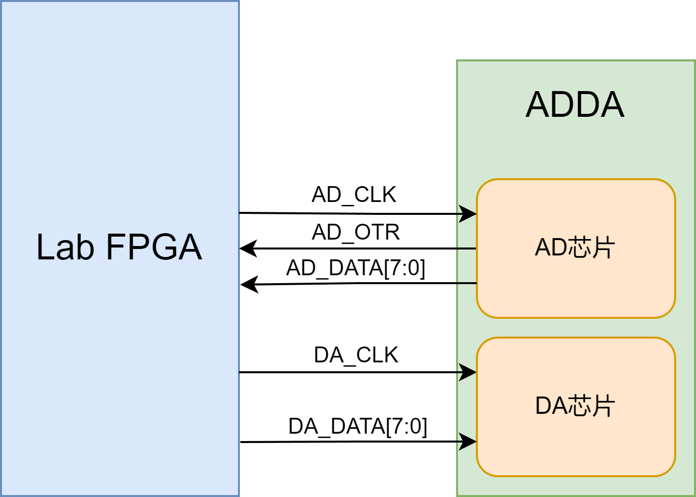
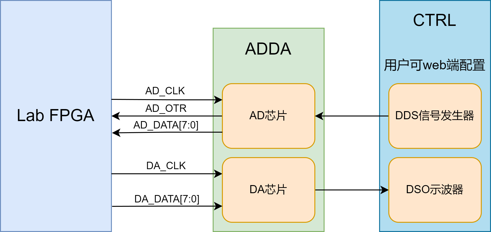

# 进阶-3-频率计

## 3.1 章节导读

本实验将基于实验平台设计并实现一个简易频率计，用于测量输入信号的频率值，并通过数码管进行实时显示。实验核心是掌握ADC模块的使用方法，被测信号频率的获取方法及其在数字系统中的处理流程。

## 3.2 理论学习

### 3.2.1 ADC模块

实验平台有一块8bit高速ADDA模块，其中ADC模块使用AD9280芯片，支持最高32MSPS的速率，模拟电压输入范围为-5~+5V，ADC模块可以根据输入电压的大小将其转换为0~255（2的8次方）的数值。模块有一个clk管脚和8个data管脚，data的输入速率和驱动时钟有关，给clk管脚的驱动时钟越快，采样率越高，data的输入速率越高。

<div>           <!--块级封装-->
    <center>    <!--将图片和文字居中-->
    
    <br>        <!--换行-->
    图1.ADDA模块示意图   <!--标题-->
    </center>
</div>

### 3.2.2 数码管模块

数码管模块在前面基础实验3已经介绍过，这里不再赘述。

## 3.3 实战演练

### 3.3.1实验目标

能够驱动板载ADC模块，对ADC模块的输入数据进行测试，计算输入信号的频率值，并在数码管模块中显示。

### 3.3.2硬件资源

实验所需的信号源来自我们的实验平台，实验平台集成一个以FPGA为基础的dds信号发生器，该dds信号发生器可以输出频率可调的方波，正弦波，三角波，锯齿波等，用户可以在web平台使用并且改变输出波形和频率。

<div>           <!--块级封装-->
    <center>    <!--将图片和文字居中-->
    
    <br>        <!--换行-->
    图2.ADDA实验示意图   <!--标题-->
    </center>
</div>

用户接收到信号源之后需自行设计逻辑处理数据并显示。

### 3.3.3程序设计

#### pulse_gen.v

首先用户接收到的是8bit波形数据，要直接利用波形数据计算频率不是很方便，计算频率数据，我们只需要计算其脉冲的个数即可，所以我们设计一个模块，通过设计一个脉冲阈值trig_level，高于阈值的就计算为一次脉冲，输出一个周期的高电平方便后续模块计数，模块代码如下：

```verilog
module pulse_gen(
    input           rstn,      //系统复位，低电平有效
    
    input  [7:0]    trig_level,
    input           ad_clk,     //AD9280驱动时钟
    input  [7:0]    ad_data,    //AD输入数据
    
    output          ad_pulse    //输出的脉冲信号
);
//因为可能会有抖动，设置一个范围值避免反复触发
parameter THR_DATA = 3;

//reg define
reg          pulse;
reg          pulse_delay;

//*****************************************************
//**                    main code
//*****************************************************

assign ad_pulse = pulse & pulse_delay;

//根据触发电平，将输入的AD采样值转换成高低电平
always @ (posedge ad_clk or negedge rstn)begin
    if(!rstn)
        pulse <= 1'b0;
    else begin
        if((trig_level >= THR_DATA) && (ad_data < trig_level - THR_DATA))
            pulse <= 1'b0;
        else if(ad_data > trig_level + THR_DATA)
            pulse <= 1'b1;
    end    
end

//延时一个时钟周期，用于消除抖动
always @ (posedge ad_clk or negedge rstn)begin
    if(!rstn)
        pulse_delay <= 1'b0;
    else
        pulse_delay <= pulse;
end

endmodule 
```

#### cymometer.v

下面根据pulse_gen信号生成的脉冲数据进行计数，计算其频率。我们这里采用门控时钟法，用 `clk_fs`（参考时钟）作为时间基准，测量 `clk_fx`（被测信号）的频率。

门控时钟法的原理很简单，也就是在一个**固定时间窗内**（即门控时间 `GATE_TIME`），**计数被测时钟 clk_fx 的上升沿次数**，再结合参考时钟 `clk_fs` 的计数值，就可以算出频率：
$$
\text{频率} = \frac{\text{被测脉冲数量}}{\text{门控时间（秒）}} = \frac{fx\_cnt}{fs\_cnt / \text{CLK\_FS}} = \frac{\text{CLK\_FS} \times fx\_cnt}{fs\_cnt}
$$

| 步骤 | 描述                                                         |
| ---- | ------------------------------------------------------------ |
| **1**    | 使用 `clk_fx` 作为计数时钟，控制一个门控时间 `gate` 信号     |
|  **2**     | 当 `gate` 为高电平时，`fx_cnt_temp` 开始统计 `clk_fx` 的脉冲个数 |
|  **3**      | 同时将 `gate` 同步到参考时钟 `clk_fs`，并计数 `fs_cnt_temp`，记录 `gate` 高电平持续期间 `clk_fs` 的个数 |
|  **4**     | 一旦 `gate` 下降沿到来（通过打拍检测），将计数值冻结到 `fx_cnt` 和 `fs_cnt` 中 |
|  **5**     | 最后用上述表达式计算频率输出。                          |

代码设计如下：

```verilog
module cymometer
   #(parameter    CLK_FS = 26'd50_000_000) // 基准时钟频率值
    (   //system clock
        input                 clk_fs ,     // 基准时钟信号
        input                 rstn  ,     // 复位信号

        //cymometer interface
        input                 clk_fx ,     // 被测时钟信号
        output   reg [19:0]   data_fx      // 被测时钟频率输出
);

//parameter define
localparam   MAX       =  30;              // 定义fs_cnt、fx_cnt的最大位宽
localparam   GATE_TIME = 16'd2_000;        // 门控时间设置

//reg define
reg                gate        ;           // 门控信号
reg                gate_fs     ;           // 同步到基准时钟的门控信号
reg                gate_fs_r   ;           // 用于同步gate信号的寄存器
reg                gate_fs_d0  ;           // 用于采集基准时钟下gate下降沿
reg                gate_fs_d1  ;           // 
reg                gate_fx_d0  ;           // 用于采集被测时钟下gate下降沿
reg                gate_fx_d1  ;           // 
reg    [   58:0]   data_fx_t    ;          // 
reg    [   15:0]   gate_cnt    ;           // 门控计数
reg    [MAX-1:0]   fs_cnt      ;           // 门控时间内基准时钟的计数值
reg    [MAX-1:0]   fs_cnt_temp ;           // fs_cnt 临时值
reg    [MAX-1:0]   fx_cnt      ;           // 门控时间内被测时钟的计数值
reg    [MAX-1:0]   fx_cnt_temp ;           // fx_cnt 临时值

//wire define
wire               neg_gate_fs;            // 基准时钟下门控信号下降沿
wire               neg_gate_fx;            // 被测时钟下门控信号下降沿

//*****************************************************
//**                    main code
//*****************************************************

//边沿检测，捕获信号下降沿
assign neg_gate_fs = gate_fs_d1 & (~gate_fs_d0);
assign neg_gate_fx = gate_fx_d1 & (~gate_fx_d0);

//门控信号计数器，使用被测时钟计数
always @(posedge clk_fx or negedge rstn) begin
    if(!rstn)
        gate_cnt <= 16'd0; 
    else if(gate_cnt == GATE_TIME + 5'd20)
        gate_cnt <= 16'd0;
    else
        gate_cnt <= gate_cnt + 1'b1;
end

//门控信号，拉高时间为GATE_TIME个实测时钟周期
always @(posedge clk_fx or negedge rstn) begin
    if(!rstn)
        gate <= 1'b0;
    else if(gate_cnt < 4'd10)
        gate <= 1'b0;     
    else if(gate_cnt < GATE_TIME + 4'd10)
        gate <= 1'b1;
    else if(gate_cnt <= GATE_TIME + 5'd20)
        gate <= 1'b0;
    else 
        gate <= 1'b0;
end

//将门控信号同步到基准时钟下
always @(posedge clk_fs or negedge rstn) begin
    if(!rstn) begin
        gate_fs_r <= 1'b0;
        gate_fs   <= 1'b0;
    end
    else begin
        gate_fs_r <= gate;
        gate_fs   <= gate_fs_r;
    end
end

//打拍采门控信号的下降沿（被测时钟下）
always @(posedge clk_fx or negedge rstn) begin
    if(!rstn) begin
        gate_fx_d0 <= 1'b0;
        gate_fx_d1 <= 1'b0;
    end
    else begin
        gate_fx_d0 <= gate;
        gate_fx_d1 <= gate_fx_d0;
    end
end

//打拍采门控信号的下降沿（基准时钟下）
always @(posedge clk_fs or negedge rstn) begin
    if(!rstn) begin
        gate_fs_d0 <= 1'b0;
        gate_fs_d1 <= 1'b0;
    end
    else begin
        gate_fs_d0 <= gate_fs;
        gate_fs_d1 <= gate_fs_d0;
    end
end

 //门控时间内对被测时钟计数
always @(posedge clk_fx or negedge rstn) begin
    if(!rstn) begin
        fx_cnt_temp <= 32'd0;
        fx_cnt <= 32'd0;
    end
    else if(gate)
        fx_cnt_temp <= fx_cnt_temp + 1'b1;
    else if(neg_gate_fx) begin
        fx_cnt_temp <= 32'd0;
        fx_cnt   <= fx_cnt_temp;
    end
end 

//门控时间内对基准时钟计数
always @(posedge clk_fs or negedge rstn) begin
    if(!rstn) begin
        fs_cnt_temp <= 32'd0;
        fs_cnt <= 32'd0;
    end
    else if(gate_fs)
        fs_cnt_temp <= fs_cnt_temp + 1'b1;
    else if(neg_gate_fs) begin
        fs_cnt_temp <= 32'd0;
        fs_cnt <= fs_cnt_temp;
    end
end

//计算被测信号频率
always @(posedge clk_fs or negedge rstn) begin
    if(!rstn) begin
        data_fx_t <= 1'b0;
    end
    else if(gate_fs == 1'b0)
        data_fx_t <= CLK_FS * fx_cnt ;
end

always @(posedge clk_fs or negedge rstn) begin
    if(!rstn) begin
        data_fx <= 20'd0;
    end
    else if(gate_fs == 1'b0)
        data_fx <= data_fx_t / fs_cnt ;
end

endmodule 
```

#### frequency_meter.v

由于之前基础实验设计过数码管显示模块，本次实验不在赘述，但因为数码管模块是输入ascii码进行显示的，而现在输出频率数据是一个20bit的二进制数，所以我们应该先想办法将二进制转成ascii码再连接数码管模块进行显示。BCD转ascii码通过查表的方式即可完成。但二进制转BCD码的算法不是特别简单，之后会在基础实验部分讲解。

顶层模块代码如下：

```verilog
module frequency_meter(
    input         clk,
    input         rstn,       // 复位信号
    output        ad_clk,     // AD时钟
    input  [7:0]  ad_data,    // AD输入数据
    output [7:0]  led_display_seg,
    output wire [7:0] led_display_sel
);
wire ad_pulse;
wire [19:0] data_fx;
wire [25:0] bcd;
wire [31:0] data_bcd;
wire [63:0] asciidata;
assign data_bcd = {6'b00,bcd};
//生成ad驱动时钟，由于使用杜邦线连接，ad_clk不要超过10M
PLL PLLinst(
    .clkout0(ad_clk),    // output 10M
    .lock(),
    .clkin1(clk)       // input
);

pulse_gen  pulse_gen_inst (
    .rstn(rstn),
    .trig_level(8'd128),
    .ad_clk(ad_clk),
    .ad_data(ad_data),
    .ad_pulse(ad_pulse)
  );

cymometer # (
    .CLK_FS(32'd27_000_000)
  )
  cymometer_inst (
    .clk_fs(clk),
    .rstn(rstn),
    .clk_fx(ad_pulse),
    .data_fx(data_fx)
  );
//二进制转bcd码模块
bin2bcd # (
    .W(20)
  )
  bin2bcd_inst (
    .bin(data_fx),
    .bcd(bcd)
  );
//4位BCD码转ascii模块，例化8次使8个bcd同时输出ascii
genvar i;
generate
  for (i = 0; i < 8; i = i + 1) begin : generate_module
    bcd2ascii  bcd2ascii_inst (
        .bcd(data_bcd[i*4 +:4]),
        .asciidata(asciidata[i*8 +: 8])
      );
  end
endgenerate
//数码管显示模块
led_display_driver  led_display_driver_inst (
    .clk(clk),
    .rstn(rstn),
    .assic_seg(asciidata),
    .seg_point(8'b00000000),
    .led_display_seg(led_display_seg),
    .led_display_sel(led_display_sel)
  );
endmodule
```

### 3.3.4仿真验证

### 3.3.5上板验证

## 3.4 章末总结
